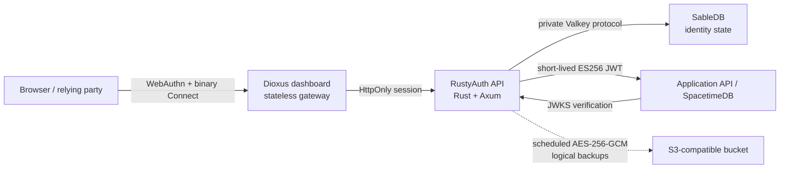

<div align="center">
  

**Built in Rust. Built on SableDB. Built for passkeys.**

A small, self-hosted Rust identity service for WebAuthn ceremonies, durable browser sessions and short-lived
ES256 access tokens.

[](LICENSE)
[](Cargo.toml)
[](#project-status)
[](https://github.com/sabledb-io/sabledb)

[Website](https://rustyauth.dev) · [Documentation](https://rustyauth.dev/docs) ·
[Source](https://github.com/rusty-auth/rustyauth)

[](https://railway.com/new/template/rustyauth?utm_medium=integration&utm_source=button&utm_campaign=rustyauth)

</div>

> [!WARNING]
> RustyAuth is pre-release software. Account recovery, abuse controls, multi-writer qualification and an
> independent security assessment are not complete. Do not make it the sole identity system for a production
> service yet.

## What RustyAuth is

RustyAuth is passkey-first authentication built in Rust on SableDB. It is a reusable authentication boundary
for applications that want passkeys without handing their identity data to a hosted identity provider. The
browser talks to a narrow Rust/Axum service; that service stores durable identity state in a private SableDB
instance and issues short-lived JWTs for downstream APIs.

RustyAuth is not a user-interface framework, authorization engine or general OpenID Provider. It authenticates
an identity and produces claims. Your application remains responsible for roles, permissions, entitlements and
resource ownership.

### Implemented today

- WebAuthn passkey registration and authentication with five-minute, server-side, single-use ceremonies;
- persistent users, passkeys and sessions in SableDB using its Valkey-compatible protocol;
- multiple canonical email/phone identifiers and optional given, family and display names per stable account
  UUID;
- HttpOnly, SameSite=Strict sessions with idle and absolute expiry;
- multiple passkeys per account, labels, last-used timestamps and final-credential protection;
- passkey revocation that immediately ends the sessions that passkey created;
- recent-authentication enforcement before credential removal;
- passkey sign-counter regression detection;
- ES256 JWT issuance with issuer, audience, tenant, subject, session and authentication-method claims;
- OpenID-style discovery and a public JWKS endpoint;
- ordered, cursor-based authentication-event polling and gRPC streaming;
- private Connect/gRPC identity reads, exact search and controlled mutations;
- a separately deployable Dioxus dashboard with passkey registration, authentication, server-side sign-out,
  binary Connect/Protobuf, responsive web and shared desktop/mobile feature builds;
- a durable Fleet control-plane slice for organizations, projects, environments, scoped role bindings, central
  audit, realm discovery and single-use pairing without direct access to realm databases;
- durable single-organization settings and role-gated operator access;
- scoped service accounts with independently revocable, one-time credentials and short-lived ES256 token
  exchange;
- exact-origin CORS and request-origin enforcement;
- browser response hardening with CSP, frame denial, cross-origin isolation, a restrictive permissions policy
  and production HSTS;
- bounded request duration, request body size and shutdown grace;
- liveness, dependency readiness, request IDs and structured JSON logging;
- development-only, one-use agent browser handoffs for an existing account;
- automatic staged signing-key rotation with overlapping JWKS publication; and
- scheduled, authenticated logical backups to S3-compatible storage with verification and clean-room restore
  commands.

See [Project status](#project-status) for functionality that is deliberately not claimed yet.

## Architecture



Only the stateless dashboard gateway is public in the operator topology. The Rust API and SableDB remain
private; SableDB is a persistence engine, not the authorization boundary. A downstream service must verify the
JWT signature, `iss`, `aud`, `exp`, `tenant_id` and the claims relevant to its own policy.

Read [Architecture](docs/ARCHITECTURE.md) for the trust boundaries, data model and complete flows.

## Quick start

Requirements: Docker with Compose, OpenSSL and `curl`.

```sh
git clone https://github.com/rusty-auth/rustyauth.git
cd rustyauth
scripts/local-stack standalone up
```

The standalone command creates private secrets in the ignored `.env.standalone.local`, then starts the
separate Dioxus dashboard, realm backend and private SableDB. Open `http://localhost:8081`. Use the first-run
setup screen and the generated bootstrap token to create the allowlisted local owner passkey, or use
`?preview=1` without mutating SableDB.

If a port is occupied, set `STANDALONE_DASHBOARD_PORT` or `FLEET_DASHBOARD_PORT` before running the launcher;
the local issuer and WebAuthn origin follow the selected port automatically.

To run the central Fleet topology on `http://localhost:5196` instead:

```sh
scripts/local-stack fleet up
```

```sh
curl --fail http://127.0.0.1:8081/healthz
curl --fail http://127.0.0.1:8081/readyz
curl --fail http://127.0.0.1:8081/.well-known/passkey-auth
```

Stop the containers without deleting identity data:

```sh
scripts/local-stack standalone down
```

The `sabledb_data` volume survives container replacement. Add `--volumes` only when you intentionally want to
erase the local identity store.

> [!IMPORTANT]
> No secret ships with a value. `.env.example` leaves every one blank and `compose.yaml` refuses to substitute
> a default, so an unpopulated `.env` stops the stack by name rather than starting on something readable in
> this repository. Generate each secret independently, including for local work. RustyAuth additionally
> refuses a 32-byte key whose bytes are all identical, which catches an unedited `0000…` placeholder — but
> that check cannot tell a generated key from a published one, which is why there are no defaults to inherit.

## Backup, key and operator operations

The same binary provides a small operator CLI. When backup storage is configured, the service creates a
verified logical backup after startup and every six hours by default; signing-key maintenance is automatic.

```sh
rustyauth doctor
rustyauth backup create
rustyauth backup list
rustyauth backup verify <object-key>
rustyauth keys status
rustyauth keys rotate
rustyauth operator list
rustyauth operator find <email>
rustyauth operator promote <user-id> <owner|administrator|support|auditor>
rustyauth operator demote <user-id>
```

`operator promote` is the supported way to create the first Owner. Dashboard bootstrap requires an operator
email the account has already **verified**, and verifying an identifier is itself an operator action — so on a
fresh deployment neither can happen first. The CLI breaks that cycle, and deliberately costs shell access to
the deployment rather than control of an inbox. Setting `AUTH_OPERATOR_EMAILS` alone is no longer enough to
become an operator.

Run restore as an offline operation against an empty RustyAuth namespace:

```sh
rustyauth backup restore <object-key>
rustyauth doctor
```

Restore invalidates sessions by default, creates fresh signing-key material and fails closed if its final
security steps do not complete. `--preserve-sessions` exists only for an explicitly reviewed incident
response. See [Configuration](docs/CONFIGURATION.md) for key-overlap settings and
[Deployment](docs/DEPLOYMENT.md) for the clean-room recovery runbook.

## How integration works

Runnable end-to-end material lives in [examples/](examples/README.md): a static relying party exercising the
full ceremony flow and a Node service verifying issued tokens against JWKS. The
[`@rustyauth/client`](packages/client/README.md) package wraps the browser side of these flows, including the
WebAuthn JSON encoding.

### Registration

1. A trusted enrolment controller authorizes a new account with `x-bootstrap-token`.
2. RustyAuth creates WebAuthn registration options and stores the ceremony for five minutes.
3. The browser calls `navigator.credentials.create()` and returns the credential.
4. RustyAuth atomically consumes the ceremony, verifies the credential, creates the user and starts a session.

The bootstrap token is an administrative enrolment credential. Never ship it in a production browser bundle.
Replace bootstrap enrolment with your reviewed invitation or provisioning boundary before production use.

### Sign-in and token exchange

1. The browser requests authentication options for a canonical email address or E.164 phone number.
2. RustyAuth stores a single-use ceremony and returns WebAuthn options.
3. The browser calls `navigator.credentials.get()` and returns the assertion.
4. RustyAuth verifies user presence and verification, advances credential state and creates an HttpOnly
   session.
5. The browser calls `POST /v1/token`; RustyAuth returns a short-lived ES256 access token while the durable
   session remains in its cookie.
6. The downstream service verifies that token against `/.well-known/jwks.json` and applies its own
   authorization.

The access token is returned in JSON and should be held in memory, not local storage. Session tokens are
stored only as SHA-256-derived SableDB keys; the raw bearer value lives in the HttpOnly cookie.

## Public endpoints

| Endpoint                                   | Access                   | Purpose                                               |
| ------------------------------------------ | ------------------------ | ----------------------------------------------------- |
| `GET /healthz`                             | Public                   | Process liveness                                      |
| `GET /readyz`                              | Public                   | SableDB-backed readiness                              |
| `GET /.well-known/passkey-auth`            | Public                   | Runtime capabilities                                  |
| `GET /.well-known/openid-configuration`    | Public                   | Issuer and token metadata                             |
| `GET /.well-known/jwks.json`               | Public                   | Active, staged and overlapping ES256 public keys      |
| `POST /v1/passkeys/registration/options`   | Origin + bootstrap       | Start initial registration                            |
| `POST /v1/passkeys/registration/verify`    | Origin + bootstrap       | Finish initial registration                           |
| `POST /v1/passkeys/authentication/options` | Origin                   | Start passkey sign-in                                 |
| `POST /v1/passkeys/authentication/verify`  | Origin                   | Finish passkey sign-in                                |
| `POST /v1/token`                           | Session + origin         | Mint a short-lived access token                       |
| `POST /v1/sign-out`                        | Origin                   | Revoke the current session                            |
| `GET /v1/account`                          | Session + origin         | Read profile and email/phone identifiers              |
| `POST /v1/account/profile`                 | Passkey session + origin | Replace given, family and display names               |
| `POST /v1/account/identifiers*`            | Recent passkey + origin  | Add, remove or select a primary identifier            |
| `GET /v1/credentials`                      | Session + origin         | List account passkeys                                 |
| `POST /v1/passkeys/registration/add/*`     | Recent passkey + origin  | Add another passkey                                   |
| `POST /v1/credentials/rename`              | Passkey session + origin | Rename a passkey                                      |
| `POST /v1/credentials/revoke`              | Recent passkey + origin  | Remove a non-final passkey                            |
| `GET /v1/events?after=N`                   | Bootstrap                | Poll up to 500 ordered events                         |
| `POST /v1/email-links`                     | Origin                   | Record a sign-in request; delivery is not implemented |

The complete HTTP and private RPC contracts are documented in [API](docs/API.md). The private
`rustyauth.identity.v1` service reads/searches profile, identifier and passkey metadata and applies controlled
identity mutations. `rustyauth.organization.v1` and `rustyauth.service_accounts.v1` are authorized by passkey
operator sessions; service-account credential exchange returns scoped, short-lived JWTs. `rustyauth.events.v1`
provides resumable server streaming. All services support Connect, gRPC-Web and gRPC. The API may change
before `1.0`; pin a release or commit.

## Configuration and deployment

RustyAuth validates all required configuration at startup and fails closed on an unset `AUTH_ENV`, placeholder
encryption keys with no entropy, partial backup configuration, invalid origins, weak production bootstrap
tokens and plaintext production SableDB addresses outside private networking.

- [Configuration reference](docs/CONFIGURATION.md)
- [Docker and Railway deployment](docs/DEPLOYMENT.md)
- [Security policy and threat model](SECURITY.md)

The intended production topology is one public RustyAuth container, one private persistent SableDB container
and an optional private S3-compatible bucket. Railway is the first packaging target, not a runtime dependency.

## Project status

RustyAuth is currently `0.1.0` pre-release software.

| Capability                                                  | Status                                                                                                                                                                                |
| ----------------------------------------------------------- | ------------------------------------------------------------------------------------------------------------------------------------------------------------------------------------- |
| Passkey registration and authentication                     | Implemented                                                                                                                                                                           |
| Multiple email/phone identifiers and basic account profiles | Implemented; external verification delivery required                                                                                                                                  |
| Durable sessions and credential management                  | Implemented                                                                                                                                                                           |
| ES256 JWT, JWKS and automatic rotation                      | Implemented with prepublication and retired-key overlap                                                                                                                               |
| Ordered HTTP event polling and gRPC event streaming         | Implemented                                                                                                                                                                           |
| Private identity gRPC reads, exact search and mutations     | Implemented                                                                                                                                                                           |
| Passkey-authenticated operator dashboard                    | Implemented; first owner created with `operator promote`, browser bootstrap requires a verified allowlisted email                                                                     |
| Organization and operator control plane                     | Implemented for one organization per instance                                                                                                                                         |
| Service accounts and credential exchange                    | Implemented with scoped, one-time credentials                                                                                                                                         |
| Email sign-in and verification delivery                     | Event recording only                                                                                                                                                                  |
| Account recovery                                            | Not implemented                                                                                                                                                                       |
| Scheduled encrypted logical backups                         | Implemented with manifests and read-after-write verification                                                                                                                          |
| Snapshot restore                                            | Implemented for an empty target; sessions invalidated by default                                                                                                                      |
| Webhook event delivery                                      | Not implemented                                                                                                                                                                       |
| Webhook and metrics control plane                           | Dashboard preview and protobuf contracts only; durable handlers not implemented                                                                                                       |
| Multi-tenant runtime isolation                              | Claims/events are tenant-tagged; one configured tenant per instance                                                                                                                   |
| Fleet management across isolated deployments                | First functional slice implemented: hierarchy, scoped role bindings, audit, discovery, public-endpoint pairing and revocation; outbound connector and production qualification remain |
| Cross-platform Dioxus fleet console                         | Live web passkeys, binary Connect, hierarchy and pairing implemented; web and desktop builds pass, while native credential transport and mobile packaging remain                      |
| Independent security review                                 | Not completed                                                                                                                                                                         |

Production `1.0` still requires account recovery and abuse controls, event retention/webhook policy,
cross-instance concurrency review, dependency and protocol audits, authenticator coverage and an independent
security assessment. The detailed gate is documented in [Architecture](docs/ARCHITECTURE.md) and the
[Security policy](SECURITY.md).

The [roadmap](docs/ROADMAP.md) keeps the single-tenant foundation intact while delivering the
[Fleet control plane](docs/FLEET_CONTROL_PLANE.md) as a separate management plane for isolated deployments.

## Development

Rust `1.94.1` is the minimum declared toolchain. The container currently builds with Rust `1.97`.

```sh
cargo fmt --check
cargo clippy --all-targets --all-features -- -D warnings
cargo test
cargo build --locked --release
```

Tests cover configuration validation, browser-handoff confinement, credential input validation, signing-key
lifecycle and authenticated backup envelopes. CI also performs a clean-room recovery drill against real
SableDB and S3-compatible MinIO services. Concurrency, authenticator and broader protocol-negative coverage
must expand before production readiness.

See [CONTRIBUTING.md](CONTRIBUTING.md) for the development workflow and security-sensitive change
requirements.

The marketing website is an Astro workspace managed with Deno. The product dashboard is Dioxus/Rust:

```sh
deno install
deno task site:dev
deno task site:test
deno task console:check
deno task console:check:desktop
deno task console:check:mobile
deno task console:build:web
```

ConnectRPC contracts live in `proto/` and `packages/protocol`; the public HTTP client lives in
`packages/client`. The legacy Solid adapter remains source-only during migration and is no longer shipped or
published. Regenerate and verify the active contracts with:

```sh
deno task gen
deno task connect:check
deno task connect:test
```

Cloudflare Pages and `rustyauth.dev` are managed in [`infra/cloudflare`](infra/cloudflare/README.md) with
Pulumi. Production credentials are injected from the maintainers' self-hosted Infisical environment and are
never committed or stored in plain Pulumi configuration.

## Documentation

| Document                                                                                          | Contents                                                                                                  |
| ------------------------------------------------------------------------------------------------- | --------------------------------------------------------------------------------------------------------- |
| [Roadmap](docs/ROADMAP.md)                                                                        | Current single-tenant priorities and later product directions                                             |
| [Architecture](docs/ARCHITECTURE.md)                                                              | Components, flows, state and trust boundaries                                                             |
| [Fleet control-plane direction](docs/FLEET_CONTROL_PLANE.md)                                      | Active standalone and cross-cloud fleet-management architecture                                           |
| [Federated Fleet Analytics program](docs/FLEET_ANALYTICS.md)                                      | Post-Fleet metric semantics, cross-cloud delivery, GreptimeDB serving, Parquet recovery and gated roadmap |
| [Unified Fleet control-plane decision](docs/decisions/0003-unified-dioxus-fleet-control-plane.md) | Dioxus, service, transport, hierarchy and datastore boundaries for Fleet                                  |
| [Federated Fleet Analytics decision](docs/decisions/0004-federated-fleet-analytics.md)            | Proposed trusted rollup, GreptimeDB and Parquet architecture after Fleet ships                            |
| [Cross-platform console decision](docs/decisions/0002-cross-platform-fleet-console.md)            | Dioxus client targets, embedded-dashboard coexistence and trust boundaries                                |
| [Identity data model](docs/IDENTITY_DATA_MODEL.md)                                                | Every persisted identity field, invariant, index and API projection                                       |
| [Dashboard control-plane decision](docs/decisions/0001-dashboard-control-plane.md)                | SolidJS, ConnectRPC, Rust, Railway and SableDB trust boundaries                                           |
| [Engineering](docs/ENGINEERING.md)                                                                | Module ownership, coding standards and quality gates                                                      |
| [HTTP API](docs/API.md)                                                                           | Endpoints, inputs, responses and access requirements                                                      |
| [OpenAPI specification](docs/openapi.yaml)                                                        | Machine-readable contract for the public HTTP endpoints                                                   |
| [Examples](examples/README.md)                                                                    | Runnable relying-party and JWT-verification integrations                                                  |
| [Releasing](RELEASING.md)                                                                         | Tagged releases, container image, JSR and BSR publishing                                                  |
| [Configuration](docs/CONFIGURATION.md)                                                            | Every environment variable and validation rule                                                            |
| [Deployment](docs/DEPLOYMENT.md)                                                                  | Docker, Railway, persistence and operations                                                               |
| [Security policy](SECURITY.md)                                                                    | Reporting, threat model and known limitations                                                             |
| [Contributing](CONTRIBUTING.md)                                                                   | Build, review and pull-request expectations                                                               |
| [Code of conduct](CODE_OF_CONDUCT.md)                                                             | Community expectations and enforcement                                                                    |
| [Brand guide](docs/BRAND.md)                                                                      | Naming, voice, logo and attribution usage                                                                 |
| [Changelog](CHANGELOG.md)                                                                         | Release-facing changes and migration notes                                                                |
| [Third-party notices](THIRD_PARTY_NOTICES.md)                                                     | SableDB and dependency licensing                                                                          |
| [Third-party licence inventory](THIRD_PARTY_LICENSES.html)                                        | Generated licence texts for the locked Cargo graph                                                        |

## Brand and independence

Write the product name as **RustyAuth** with no space. The primary strapline is:

> Built in Rust. Built on SableDB. Built for passkeys.

RustyAuth is an independent project. It is not sponsored, endorsed or maintained by the Rust Foundation, the
Rust Project, SableDB or their contributors. It does not use the Rust cog, Cargo or Ferris artwork. See
[Brand](docs/BRAND.md) and [Trademarks](TRADEMARKS.md).

## Licence

RustyAuth is copyright 2026 Livermore Ledger Ltd and licensed under the [Apache License 2.0](LICENSE).
Contributions submitted for inclusion are licensed on the same terms unless explicitly agreed otherwise.

RustyAuth builds and distributes SableDB as a separate container under SableDB's BSD three-clause licence. The
upstream notice and disclaimer are reproduced in [THIRD_PARTY_NOTICES.md](THIRD_PARTY_NOTICES.md) and copied
into the SableDB image.

The Apache licence covers the source code; it does not grant rights to the RustyAuth name or logos. See
[NOTICE](NOTICE) and [TRADEMARKS.md](TRADEMARKS.md).
