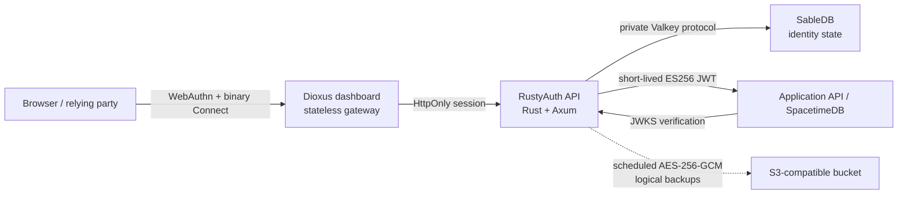

<div align="center">
  

**Built in Rust. Built on SableDB. Built for passkeys.**

A small, self-hosted Rust identity service for WebAuthn ceremonies, durable browser sessions and short-lived
ES256 access tokens.

[](LICENSE)
[](Cargo.toml)
[](#project-status)
[](https://github.com/sabledb-io/sabledb)

[Website](https://rustyauth.dev) · [Developer docs](https://rustyauth.dev/docs) ·
[Repository docs](docs/README.md) · [Source](https://github.com/rusty-auth/rustyauth)

[](https://railway.com/new/template/rustyauth?utm_medium=integration&utm_source=button&utm_campaign=rustyauth)

</div>

> [!IMPORTANT]
> RustyAuth `1.0.0` is generally available for the Rust server, container deployment topologies and Dioxus web
> dashboard. Desktop, iOS and Android applications remain preview-only and are outside the `1.0.0` support
> contract. Tagged and registry artifacts are published only by the evidence-gated release workflow; pin an
> exact released version or image digest in production.

## What RustyAuth is

RustyAuth is passkey-first authentication built in Rust on SableDB. It is a reusable authentication boundary
for applications that want passkeys without handing their identity data to a hosted identity provider. The
browser talks to a narrow Rust/Axum service; that service stores durable identity state in a private SableDB
instance and issues short-lived JWTs for downstream APIs.

RustyAuth is not a user-interface framework, authorization engine or general OpenID Provider. It authenticates
an identity and produces claims. Your application remains responsible for roles, permissions, entitlements and
resource ownership.

### Implemented today

- WebAuthn passkey registration and authentication with five-minute, server-side, single-use ceremonies;
- persistent users, passkeys and sessions in SableDB using its Valkey-compatible protocol;
- multiple canonical email/phone identifiers and optional given, family and display names per stable account
  UUID;
- HttpOnly, SameSite=Strict sessions with idle and absolute expiry;
- multiple passkeys per account, labels, last-used timestamps and final-credential protection;
- passkey revocation that immediately ends the sessions that passkey created;
- recent-authentication enforcement before credential removal;
- passkey sign-counter regression detection;
- ES256 JWT issuance with issuer, audience, tenant, subject, session and authentication-method claims;
- OpenID-style discovery and a public JWKS endpoint;
- ordered, cursor-based authentication-event polling and gRPC streaming;
- private Connect/gRPC identity reads, exact search and controlled mutations;
- a separately deployable Dioxus web dashboard with passkey registration, authentication, server-side
  sign-out, binary Connect/Protobuf and responsive layouts, plus shared preview-only desktop/mobile feature
  builds;
- a durable Fleet control-plane slice for organizations, projects, environments, scoped role bindings, central
  audit, realm discovery and single-use pairing without direct access to realm databases;
- durable single-organization settings and role-gated operator access;
- scoped service accounts with independently revocable, one-time credentials and short-lived ES256 token
  exchange;
- exact-origin CORS and request-origin enforcement;
- browser response hardening with CSP, frame denial, cross-origin isolation, a restrictive permissions policy
  and production HSTS;
- bounded request duration, request body size and shutdown grace;
- liveness, dependency readiness, request IDs and structured JSON logging;
- development-only, one-use agent browser handoffs for an existing account;
- automatic staged signing-key rotation with overlapping JWKS publication; and
- scheduled, authenticated logical backups to S3-compatible storage with verification and clean-room restore
  commands.

See [Project status](#project-status) for functionality that is deliberately not claimed yet.

## Architecture



Only the stateless dashboard gateway is public in the operator topology. The Rust API and SableDB remain
private; SableDB is a persistence engine, not the authorization boundary. A downstream service must verify the
JWT signature, `iss`, `aud`, `exp`, `tenant_id` and the claims relevant to its own policy.

Read [Architecture](docs/ARCHITECTURE.md) for the trust boundaries, data model and complete flows.

## Quick start

Requirements: Docker with Compose, OpenSSL and `curl`.

```sh
git clone https://github.com/rusty-auth/rustyauth.git
cd rustyauth
scripts/local-stack standalone up
```

The standalone command creates private secrets in the ignored `.env.standalone.local`, then starts the
separate Dioxus dashboard, realm backend and private SableDB. It also derives an ignored local configuration
from [`rustyauth.example.yaml`](rustyauth.example.yaml), keeping the public origin aligned when the local port
is overridden. Open `http://localhost:8081`. Use the first-run setup screen and the generated bootstrap token
to create the allowlisted local owner passkey, or use `?preview=1` without mutating SableDB.

If a port is occupied, set `STANDALONE_DASHBOARD_PORT` or `FLEET_DASHBOARD_PORT` before running the launcher;
the local issuer and WebAuthn origin follow the selected port automatically.

To run the central Fleet topology on `http://localhost:5196` instead:

```sh
scripts/local-stack fleet up
```

```sh
curl --fail http://127.0.0.1:8081/healthz
curl --fail http://127.0.0.1:8081/readyz
curl --fail http://127.0.0.1:8081/.well-known/passkey-auth
```

Stop the containers without deleting identity data:

```sh
scripts/local-stack standalone down
```

The `sabledb_data` volume survives container replacement. Add `--volumes` only when you intentionally want to
erase the local identity store.

> [!IMPORTANT]
> The checked-in YAML contains only non-secret policy. No secret ships with a value: `.env.example` leaves
> every secret blank and `compose.yaml` refuses to substitute a default, so an unpopulated `.env` stops the
> stack by name rather than starting on something readable in this repository. Generate each secret
> independently, including for local work. RustyAuth additionally refuses a 32-byte key whose bytes are all
> identical, which catches an unedited `0000…` placeholder — but that check cannot tell a generated key from a
> published one, which is why there are no defaults to inherit.

## Configuration as code

Each RustyAuth container can load one versioned YAML document describing its issuer, WebAuthn relying party,
private service endpoint, token and session lifetimes, signing-key lifecycle, operator bootstrap allowlist and
backup policy. Realm documents can also declare webhook destinations as deployment-owned desired state.
Secrets remain separate environment variables or Docker secret files.

```sh
rustyauth config example realm > rustyauth.yaml
rustyauth config validate rustyauth.yaml
rustyauth --config rustyauth.yaml
```

Containers automatically read `/etc/rustyauth/config.yaml`. Platforms without file mounts, including Railway,
can supply the identical document as the multiline `RUSTYAUTH_CONFIG_YAML` variable. Existing environment-only
deployments continue to work. See [Configuration](docs/CONFIGURATION.md) for precedence, secret inputs,
Compose, Railway, webhook ownership and the production backup example. Values declared as IaC remain
deployment-owned: the dashboard identifies them as managed by YAML instead of presenting a second writer.

## Backup, key and operator operations

The same binary provides a small operator CLI. When backup storage is configured, the service creates a
verified logical backup after startup and every six hours by default; signing-key maintenance is automatic.

```sh
rustyauth doctor
rustyauth backup create
rustyauth backup list
rustyauth backup status
rustyauth backup verify <object-key>
rustyauth keys status
rustyauth keys rotate
rustyauth operator list
rustyauth operator find <email>
rustyauth operator promote <user-id> <owner|administrator|support|auditor>
rustyauth operator demote <user-id>
```

`operator promote` is the supported way to create the first Owner. Dashboard bootstrap requires an operator
email the account has already **verified**, and verifying an identifier is itself an operator action — so on a
fresh deployment neither can happen first. The CLI breaks that cycle, and deliberately costs privileged
container-command access to the deployment (the production image has no shell) rather than control of an
inbox. Setting `AUTH_OPERATOR_EMAILS` alone is no longer enough to
become an operator.

Run restore as an offline operation against an empty RustyAuth namespace:

```sh
rustyauth backup restore <object-key>
rustyauth doctor
```

Restore invalidates sessions by default, creates fresh signing-key material and fails closed if its final
security steps do not complete. `--preserve-sessions` exists only for an explicitly reviewed incident
response. See [Configuration](docs/CONFIGURATION.md) for key-overlap settings and
[Backups and disaster recovery](docs/BACKUPS.md) for the format, complete recovery boundary and clean-room
runbook.

## How integration works

Runnable end-to-end material lives in [examples/](examples/README.md): a static relying party exercising the
full ceremony flow and a Node service verifying issued tokens against JWKS. The
[`@rustyauth/client`](packages/client/README.md) package wraps the browser side of these flows, including the
WebAuthn JSON encoding.

### Registration

1. A production operator issues an identifier-bound, one-time invitation; local development may instead use
   `x-bootstrap-token`.
2. RustyAuth creates WebAuthn registration options and stores the ceremony for five minutes.
3. The browser calls `navigator.credentials.create()` and returns the credential.
4. RustyAuth atomically consumes the ceremony, verifies the credential, creates the user and starts a session.

The bootstrap token is a development administrative credential and production registration rejects it.
Production invitation codes are returned once, stored only as digests and consumed atomically with account
creation.

### Sign-in and token exchange

1. The browser requests authentication options for a canonical email address or E.164 phone number.
2. RustyAuth stores a single-use ceremony and returns WebAuthn options.
3. The browser calls `navigator.credentials.get()` and returns the assertion.
4. RustyAuth verifies user presence and verification, advances credential state and creates an HttpOnly
   session.
5. The browser calls `POST /v1/token`; RustyAuth returns a short-lived ES256 access token while the durable
   session remains in its cookie.
6. The downstream service verifies that token against `/.well-known/jwks.json` and applies its own
   authorization.

The access token is returned in JSON and should be held in memory, not local storage. Session tokens are
stored only as SHA-256-derived SableDB keys; the raw bearer value lives in the HttpOnly cookie.

## Public endpoints

| Endpoint                                   | Access                   | Purpose                                               |
| ------------------------------------------ | ------------------------ | ----------------------------------------------------- |
| `GET /healthz`                             | Public                   | Process liveness                                      |
| `GET /readyz`                              | Public                   | SableDB-backed readiness                              |
| `GET /.well-known/passkey-auth`            | Public                   | Runtime capabilities                                  |
| `GET /.well-known/openid-configuration`    | Public                   | Issuer and token metadata                             |
| `GET /.well-known/jwks.json`               | Public                   | Active, staged and overlapping ES256 public keys      |
| `POST /v1/passkeys/registration/options`   | Origin + bootstrap       | Start initial registration                            |
| `POST /v1/passkeys/registration/verify`    | Origin + bootstrap       | Finish initial registration                           |
| `POST /v1/passkeys/authentication/options` | Origin                   | Start passkey sign-in                                 |
| `POST /v1/passkeys/authentication/verify`  | Origin                   | Finish passkey sign-in                                |
| `POST /v1/token`                           | Session + origin         | Mint a short-lived access token                       |
| `POST /v1/sign-out`                        | Origin                   | Revoke the current session                            |
| `GET /v1/account`                          | Session + origin         | Read profile and email/phone identifiers              |
| `POST /v1/account/profile`                 | Passkey session + origin | Replace given, family and display names               |
| `POST /v1/account/identifiers*`            | Recent passkey + origin  | Add, remove or select a primary identifier            |
| `GET /v1/credentials`                      | Session + origin         | List account passkeys                                 |
| `POST /v1/passkeys/registration/add/*`     | Recent passkey + origin  | Add another passkey                                   |
| `POST /v1/credentials/rename`              | Passkey session + origin | Rename a passkey                                      |
| `POST /v1/credentials/revoke`              | Recent passkey + origin  | Remove a non-final passkey                            |
| `GET /v1/events?after=N`                   | Bootstrap                | Poll up to 500 ordered events                         |
| `POST /v1/email-links`                     | Origin                   | Append a privacy-preserving sign-in request event; no token or email by design |

The complete HTTP and private RPC contracts are documented in [API](docs/API.md). The private
`rustyauth.identity.v1` service reads/searches profile, identifier and passkey metadata and applies controlled
identity mutations. `rustyauth.organization.v1` and `rustyauth.service_accounts.v1` are authorized by passkey
operator sessions; service-account credential exchange returns scoped, short-lived JWTs. `rustyauth.events.v1`
provides resumable server streaming. All services support Connect, gRPC-Web and gRPC. The `1.x` contract uses
semantic versioning; pin a release or image digest and review the changelog before upgrading.

## Configuration and deployment

RustyAuth validates all required configuration at startup and fails closed on an unset `AUTH_ENV`, placeholder
encryption keys with no entropy, partial backup configuration, invalid origins, weak production bootstrap
tokens and plaintext production SableDB addresses outside private networking.

- [Configuration reference](docs/CONFIGURATION.md)
- [Docker, Kubernetes and Railway deployment](docs/DEPLOYMENT.md)
- [Benchmarks and single-realm capacity evidence](docs/BENCHMARKS.md)
- [Kubernetes and Civo K3s Helm charts](docs/KUBERNETES.md)
- [Security policy and threat model](SECURITY.md)

The intended realm topology is a public Dioxus dashboard, a private RustyAuth backend and a private persistent
SableDB, with an optional private S3-compatible bucket. A separate Fleet project uses the same three-way
separation for its dashboard, control-plane API and central datastore. Railway is the first packaging target,
not a runtime dependency.

## Project status

RustyAuth is at `1.0.0`. The supported GA scope is the Rust server and control plane, the supplied container
topologies, and the Dioxus web dashboard. Native desktop and mobile clients remain explicit previews.

| Capability                                                  | Status                                                                                                                                                                              |
| ----------------------------------------------------------- | ----------------------------------------------------------------------------------------------------------------------------------------------------------------------------------- |
| Passkey registration and authentication                     | Implemented                                                                                                                                                                         |
| Multiple email/phone identifiers and basic account profiles | Implemented; external verification delivery required                                                                                                                                |
| Durable sessions and credential management                  | Implemented                                                                                                                                                                         |
| ES256 JWT, JWKS and automatic rotation                      | Implemented with prepublication and retired-key overlap                                                                                                                             |
| Ordered HTTP event polling and gRPC event streaming         | Implemented                                                                                                                                                                         |
| Private identity gRPC reads, exact search and mutations     | Implemented                                                                                                                                                                         |
| Passkey-authenticated operator dashboard                    | Implemented; first owner created with `operator promote`, browser bootstrap requires a verified allowlisted email                                                                   |
| Organization and operator control plane                     | Implemented for one organization per instance                                                                                                                                       |
| Service accounts and credential exchange                    | Implemented with scoped, one-time credentials                                                                                                                                       |
| Email sign-in and verification delivery                     | Sign-in-link delivery remains event-only; one-time email/phone verification challenges are delivered through exact signed-webhook subscriptions                                   |
| Account recovery                                            | Implemented with one-use recovery codes, passkey re-enrolment, session revocation and audit events                                                                                  |
| Scheduled encrypted logical backups                         | Implemented with authenticated v3 envelopes, WORM/SSE posture verification, leases, health and read-after-write verification                                                       |
| Snapshot restore                                            | Implemented for an empty target with clean-room validation, key recovery/rotation and sessions invalidated by default                                                              |
| Webhook event delivery                                      | Implemented on current main with encrypted HMAC secrets, durable history, bounded retry, replay and per-destination cursors                                                         |
| Webhook and standalone metrics control plane                | Implemented on current main; local five-minute analytics projection backs bounded per-realm metrics                                                                                 |
| Multi-tenant runtime isolation                              | Claims/events are tenant-tagged; one configured tenant per instance                                                                                                                 |
| Fleet management across isolated deployments                | Implemented hierarchy/RBAC, public and outbound pairing, step-up remote administration, source-tagged partial operations, rotation/revocation and dual audit                        |
| Federated Fleet Analytics V1                                | GA feature set: trusted export/ingestion, private canonical and materialized serving, delegated API/Dioxus, residency policy and signed Parquet recovery                            |
| Dioxus operator console                                    | Web is the supported `1.0.0` client; shared desktop/mobile builds, device tokens and OS-vault adapters remain preview-only                                                         |
| Continuous security and scale assurance                     | Automated on `main` and scheduled runs; independent assessment and extended canary evidence remain ongoing                                                                          |

The `1.0.0` source and support contract is GA. Artifact publication remains fail-closed: the `v1.0.0` tag is
created only after the machine-readable evidence record passes, then the workflow publishes and verifies the
server, control-plane, dashboard and SableDB images plus the TypeScript and Protobuf packages. Extended scale,
canary and independent security work continues as asynchronous assurance on supported releases. Desktop, iOS
and Android distribution is separately gated post-1.0 work. See [Security hardening](docs/SECURITY_HARDENING.md),
the [roadmap](docs/ROADMAP.md) and the [1.0.0 release-readiness record](docs/RELEASE_READINESS.md).

The [roadmap](docs/ROADMAP.md) keeps the single-tenant foundation intact while delivering the
[Fleet control plane](docs/FLEET_CONTROL_PLANE.md) as a separate management plane for isolated deployments.

## Development

Rust `1.94.1` is the minimum declared toolchain. The container currently builds with Rust `1.97`.

```sh
cargo fmt --check
cargo clippy --all-targets --all-features -- -D warnings
cargo test
cargo build --locked --release
```

Tests cover configuration validation, browser-handoff confinement, credential input validation, signing-key
lifecycle, authenticated backup envelopes, protocol skew/fuzzing and pinned-service fault/recovery drills. CI
also performs a clean-room recovery drill against real SableDB and S3-compatible MinIO services. Extended
browser/authenticator, published-artifact, organization-canary and independent-assessment exercises continue
through release qualification and scheduled assurance. Native distribution remains preview-only post-1.0 work.

See [CONTRIBUTING.md](CONTRIBUTING.md) for the development workflow and security-sensitive change
requirements.

The marketing website is an Astro workspace managed with Deno. The product dashboard is Dioxus/Rust:

```sh
deno install
deno task site:dev
deno task site:test
deno task console:check
deno task console:check:desktop
deno task console:check:mobile
deno task console:build:web
```

ConnectRPC contracts live in `proto/` and `packages/protocol`; the public HTTP client lives in
`packages/client`. The retired Solid product adapter is absent from product sources and release artifacts.
Regenerate and verify the active contracts with:

```sh
deno task gen
deno task connect:check
deno task connect:test
```

Cloudflare Pages and `rustyauth.dev` are managed in [`infra/cloudflare`](infra/cloudflare/README.md) with
Pulumi. Production credentials are injected from the maintainers' self-hosted Infisical environment and are
never committed or stored in plain Pulumi configuration.

## Documentation

Start at the [documentation index](docs/README.md). It separates guided journeys from normative contracts and
records which document must change with each API, schema, configuration or deployment change.

### Learn and integrate

- [Standalone quick start](docs/QUICKSTART.md)
- [Application integration](docs/INTEGRATION.md)
- [HTTP and RPC API](docs/API.md) and [OpenAPI](docs/openapi.yaml)
- [Identity data model](docs/IDENTITY_DATA_MODEL.md)
- [Runnable examples](examples/README.md)

### Deploy and operate

- [Configuration](docs/CONFIGURATION.md)
- [Docker, Kubernetes and Railway deployment](docs/DEPLOYMENT.md)
- [Kubernetes and Civo K3s Helm charts](docs/KUBERNETES.md)
- [Railway service topologies](docs/RAILWAY_TEMPLATE.md)
- [Security hardening](docs/SECURITY_HARDENING.md) and [security policy](SECURITY.md)
- [Releasing](RELEASING.md)

### Build Fleet

- [Fleet quick start](docs/FLEET_QUICKSTART.md)
- [Fleet control-plane architecture](docs/FLEET_CONTROL_PLANE.md)
- [Fleet Analytics program](docs/FLEET_ANALYTICS.md) and [V1 semantics](docs/FLEET_ANALYTICS_V1.md)
- [Roadmap](docs/ROADMAP.md) and [architecture decisions](docs/README.md#architecture-decisions)

### Contribute

- [Contributing](CONTRIBUTING.md) and [engineering standards](docs/ENGINEERING.md)
- [Code of conduct](CODE_OF_CONDUCT.md)
- [Brand](docs/BRAND.md), [changelog](CHANGELOG.md) and [third-party notices](THIRD_PARTY_NOTICES.md)

## Brand and independence

Write the product name as **RustyAuth** with no space. The primary strapline is:

> Built in Rust. Built on SableDB. Built for passkeys.

RustyAuth is an independent project. It is not sponsored, endorsed or maintained by the Rust Foundation, the
Rust Project, SableDB or their contributors. It does not use the Rust cog, Cargo or Ferris artwork. See
[Brand](docs/BRAND.md) and [Trademarks](TRADEMARKS.md).

## Licence

RustyAuth is copyright 2026 Livermore Ledger Ltd and licensed under the [Apache License 2.0](LICENSE).
Contributions submitted for inclusion are licensed on the same terms unless explicitly agreed otherwise.

RustyAuth builds and distributes SableDB as a separate container under SableDB's BSD three-clause licence. The
upstream notice and disclaimer are reproduced in [THIRD_PARTY_NOTICES.md](THIRD_PARTY_NOTICES.md) and copied
into the SableDB image.

The Apache licence covers the source code; it does not grant rights to the RustyAuth name or logos. See
[NOTICE](NOTICE) and [TRADEMARKS.md](TRADEMARKS.md).
