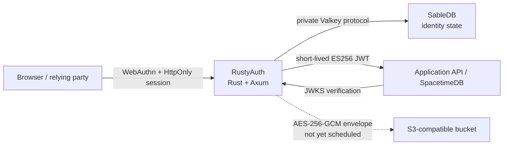

<div align="center">
  

  **Built in Rust. Built on SableDB. Built for passkeys.**

  A small, self-hosted Rust identity service for WebAuthn ceremonies, durable browser sessions
  and short-lived ES256 access tokens.

  [](LICENSE)
  [](Cargo.toml)
  [](#project-status)
  [](https://github.com/sabledb-io/sabledb)

  [Website](https://rustyauth.dev) · [Documentation](https://rustyauth.dev/docs) · [Source](https://github.com/rusty-auth/rustyauth)

  [](https://railway.com/new/template/rustyauth?utm_medium=integration&utm_source=button&utm_campaign=rustyauth)
</div>

> [!WARNING]
> RustyAuth is pre-release software. Recovery, scheduled backup/restore, signing-key rotation and an
> independent security assessment are not complete. Do not make it the sole identity system for a
> production service yet.

## What RustyAuth is

RustyAuth is passkey-first authentication built in Rust on SableDB. It is a reusable authentication
boundary for applications that want passkeys without handing
their identity data to a hosted identity provider. The browser talks to a narrow Rust/Axum service;
that service stores durable identity state in a private SableDB instance and issues short-lived JWTs
for downstream APIs.

RustyAuth is not a user-interface framework, authorization engine or general OpenID Provider. It
authenticates an identity and produces claims. Your application remains responsible for roles,
permissions, entitlements and resource ownership.

### Implemented today

- WebAuthn passkey registration and authentication with five-minute, server-side, single-use
  ceremonies;
- persistent users, passkeys and sessions in SableDB using its Valkey-compatible protocol;
- HttpOnly, SameSite=Strict sessions with idle and absolute expiry;
- multiple passkeys per account, labels, last-used timestamps and final-credential protection;
- recent-authentication enforcement before credential removal;
- passkey sign-counter regression detection;
- ES256 JWT issuance with issuer, audience, tenant, subject, session and authentication-method
  claims;
- OpenID-style discovery and a public JWKS endpoint;
- ordered, cursor-based authentication-event polling;
- exact-origin CORS and request-origin enforcement;
- liveness, dependency readiness, request IDs and structured JSON logging;
- development-only, one-use agent browser handoffs for an existing account; and
- an application-encrypted S3 upload primitive for future backup scheduling.

See [Project status](#project-status) for functionality that is deliberately not claimed yet.

## Architecture



Only RustyAuth is public. SableDB must remain private and volume-backed; it is a persistence engine,
not the authorization boundary. A downstream service must verify the JWT signature, `iss`, `aud`,
`exp`, `tenant_id` and the claims relevant to its own policy.

Read [Architecture](docs/ARCHITECTURE.md) for the trust boundaries, data model and complete flows.

## Quick start

Requirements: Docker with Compose and `curl`.

```sh
git clone https://github.com/rusty-auth/rustyauth.git
cd rustyauth
cp .env.example .env
docker compose up --build
```

The default development deployment binds RustyAuth to loopback at `http://localhost:8081` and does
not publish SableDB.

```sh
curl --fail http://127.0.0.1:8081/healthz
curl --fail http://127.0.0.1:8081/readyz
curl --fail http://127.0.0.1:8081/.well-known/passkey-auth
```

Stop the containers without deleting identity data:

```sh
docker compose down
```

The `sabledb_data` volume survives container replacement. Add `--volumes` only when you
intentionally want to erase the local identity store.

> [!IMPORTANT]
> The checked-in development key and bootstrap token are public test values. They are only safe on
> loopback. Generate independent secrets before any shared deployment.

## How integration works

### Registration

1. A trusted enrolment controller authorizes a new account with `x-bootstrap-token`.
2. RustyAuth creates WebAuthn registration options and stores the ceremony for five minutes.
3. The browser calls `navigator.credentials.create()` and returns the credential.
4. RustyAuth atomically consumes the ceremony, verifies the credential, creates the user and starts
   a session.

The bootstrap token is an administrative enrolment credential. Never ship it in a production
browser bundle. Replace bootstrap enrolment with your reviewed invitation or provisioning boundary
before production use.

### Sign-in and token exchange

1. The browser requests authentication options for a canonical email address.
2. RustyAuth stores a single-use ceremony and returns WebAuthn options.
3. The browser calls `navigator.credentials.get()` and returns the assertion.
4. RustyAuth verifies user presence and verification, advances credential state and creates an
   HttpOnly session.
5. The browser calls `POST /v1/token`; RustyAuth returns a short-lived ES256 access token while the
   durable session remains in its cookie.
6. The downstream service verifies that token against `/.well-known/jwks.json` and applies its own
   authorization.

The access token is returned in JSON and should be held in memory, not local storage. Session tokens
are stored only as SHA-256-derived SableDB keys; the raw bearer value lives in the HttpOnly cookie.

## Public endpoints

| Endpoint | Access | Purpose |
| --- | --- | --- |
| `GET /healthz` | Public | Process liveness |
| `GET /readyz` | Public | SableDB-backed readiness |
| `GET /.well-known/passkey-auth` | Public | Runtime capabilities |
| `GET /.well-known/openid-configuration` | Public | Issuer and token metadata |
| `GET /.well-known/jwks.json` | Public | Active ES256 public key |
| `POST /v1/passkeys/registration/options` | Origin + bootstrap | Start initial registration |
| `POST /v1/passkeys/registration/verify` | Origin + bootstrap | Finish initial registration |
| `POST /v1/passkeys/authentication/options` | Origin | Start passkey sign-in |
| `POST /v1/passkeys/authentication/verify` | Origin | Finish passkey sign-in |
| `POST /v1/token` | Session + origin | Mint a short-lived access token |
| `POST /v1/sign-out` | Origin | Revoke the current session |
| `GET /v1/credentials` | Session + origin | List account passkeys |
| `POST /v1/passkeys/registration/add/*` | Session + origin | Add another passkey |
| `POST /v1/credentials/rename` | Session + origin | Rename a passkey |
| `POST /v1/credentials/revoke` | Recent session + origin | Remove a non-final passkey |
| `GET /v1/events?after=N` | Bootstrap | Poll up to 500 ordered events |
| `POST /v1/email-links` | Origin | Record a sign-in request; delivery is not implemented |

The complete request/response contract and error behavior are documented in [HTTP API](docs/API.md).
The API may change before `1.0`; pin a release or commit.

## Configuration and deployment

RustyAuth validates all required configuration at startup and fails closed on partial backup
configuration, invalid origins, weak production bootstrap tokens and public production SableDB
addresses.

- [Configuration reference](docs/CONFIGURATION.md)
- [Docker and Railway deployment](docs/DEPLOYMENT.md)
- [Security policy and threat model](SECURITY.md)

The intended production topology is one public RustyAuth container, one private persistent SableDB
container and an optional private S3-compatible bucket. Railway is the first packaging target, not a
runtime dependency.

## Project status

RustyAuth is currently `0.1.0` pre-release software.

| Capability | Status |
| --- | --- |
| Passkey registration and authentication | Implemented |
| Durable sessions and credential management | Implemented |
| ES256 JWT and JWKS | Implemented; rotation not implemented |
| Ordered HTTP event polling | Implemented |
| Email sign-in and verification delivery | Event recording only |
| Account recovery | Not implemented |
| S3 envelope encryption/upload primitive | Implemented but not scheduled |
| Snapshot export and point-in-time restore | Not implemented |
| Stable streaming/webhook contract | Not implemented |
| Multi-tenant runtime isolation | Claims/events are tenant-tagged; one configured tenant per instance |
| Independent security review | Not completed |

Production `1.0` requires recovery and abuse controls, scheduled export plus tested restore,
signing-key overlap/rotation, stable events, cross-instance concurrency review, dependency and
protocol audits, authenticator coverage and an independent security assessment. The detailed gate
is documented in [Architecture](docs/ARCHITECTURE.md) and the [Security policy](SECURITY.md).

## Development

Rust `1.94.1` is the minimum declared toolchain. The container currently builds with Rust `1.97`.

```sh
cargo fmt --check
cargo clippy --all-targets --all-features -- -D warnings
cargo test
cargo build --locked --release
```

Tests currently cover configuration validation, browser-handoff confinement, credential input
validation and backup-envelope properties. Integration, concurrency and protocol-negative coverage
must expand before production readiness.

See [CONTRIBUTING.md](CONTRIBUTING.md) for the development workflow and security-sensitive change
requirements.

The website is an Astro and SolidJS workspace managed with Deno:

```sh
deno install
deno task site:dev
deno task site:test
```

Cloudflare Pages and `rustyauth.dev` are managed in
[`infra/cloudflare`](infra/cloudflare/README.md) with Pulumi. Production credentials are injected
from the maintainers' self-hosted Infisical environment and are never committed or stored in plain
Pulumi configuration.

## Documentation

| Document | Contents |
| --- | --- |
| [Architecture](docs/ARCHITECTURE.md) | Components, flows, state and trust boundaries |
| [Engineering](docs/ENGINEERING.md) | Module ownership, coding standards and quality gates |
| [HTTP API](docs/API.md) | Endpoints, inputs, responses and access requirements |
| [Configuration](docs/CONFIGURATION.md) | Every environment variable and validation rule |
| [Deployment](docs/DEPLOYMENT.md) | Docker, Railway, persistence and operations |
| [Security policy](SECURITY.md) | Reporting, threat model and known limitations |
| [Contributing](CONTRIBUTING.md) | Build, review and pull-request expectations |
| [Code of conduct](CODE_OF_CONDUCT.md) | Community expectations and enforcement |
| [Brand guide](docs/BRAND.md) | Naming, voice, logo and attribution usage |
| [Changelog](CHANGELOG.md) | Release-facing changes and migration notes |
| [Third-party notices](THIRD_PARTY_NOTICES.md) | SableDB and dependency licensing |
| [Third-party licence inventory](THIRD_PARTY_LICENSES.html) | Generated licence texts for the locked Cargo graph |

## Brand and independence

Write the product name as **RustyAuth** with no space. The primary strapline is:

> Built in Rust. Built on SableDB. Built for passkeys.

RustyAuth is an independent project. It is not sponsored, endorsed or maintained by the Rust
Foundation, the Rust Project, SableDB or their contributors. It does not use the Rust cog, Cargo or
Ferris artwork. See [Brand](docs/BRAND.md) and [Trademarks](TRADEMARKS.md).

## Licence

RustyAuth is copyright 2026 Livermore Ledger Ltd and licensed under the
[Apache License 2.0](LICENSE). Contributions submitted for inclusion are licensed on the same terms
unless explicitly agreed otherwise.

RustyAuth builds and distributes SableDB as a separate container under SableDB's BSD three-clause
licence. The upstream notice and disclaimer are reproduced in
[THIRD_PARTY_NOTICES.md](THIRD_PARTY_NOTICES.md) and copied into the SableDB image.

The Apache licence covers the source code; it does not grant rights to the RustyAuth name or logos.
See [NOTICE](NOTICE) and [TRADEMARKS.md](TRADEMARKS.md).
