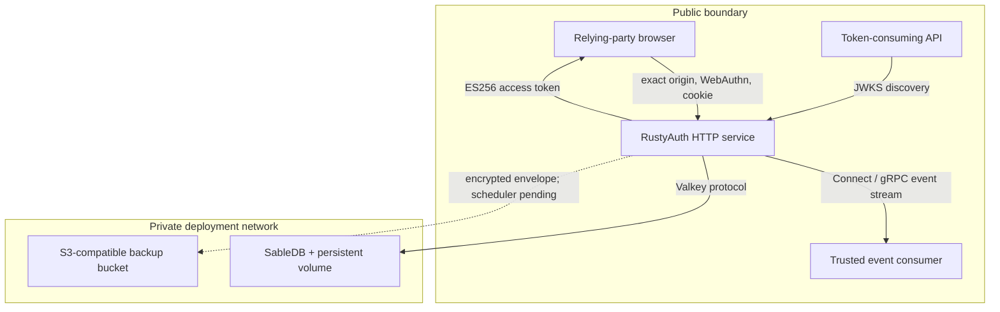
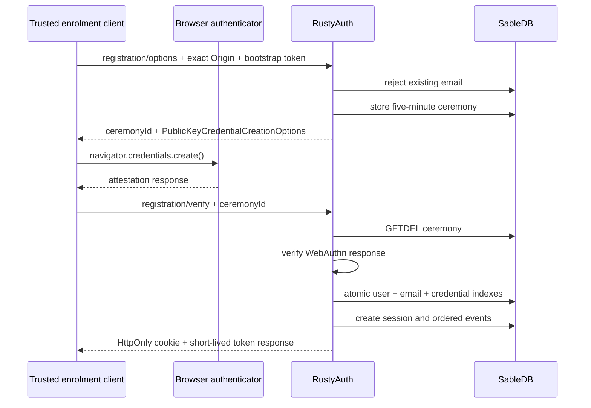

# RustyAuth architecture

This document describes the standalone RustyAuth implementation at version `0.1.0`. Statements
about future functionality are marked explicitly.

## Design goals

RustyAuth keeps the identity boundary small:

- authenticate users with passkeys;
- keep bearer sessions server-side and revocable;
- issue short-lived, audience-bound tokens to downstream services;
- keep durable identity state on private infrastructure; and
- fail closed when configuration, state or authorization is missing.

It intentionally does not decide application roles, subscriptions, entitlements or object ownership.

## Components and trust boundaries

### Browser

The browser performs WebAuthn operations and sends the resulting credential objects to RustyAuth.
It receives an opaque HttpOnly session cookie and a short-lived access JWT in a JSON response. The
intended client stores the JWT only in memory.

### RustyAuth service

One Axum process owns:

- HTTP origin and CORS enforcement;
- WebAuthn relying-party configuration and ceremony verification;
- session creation and validation;
- credential-management policy;
- JWT signing and JWKS publication;
- atomic ordered event creation, polling and streaming; and
- health/readiness reporting.

### SableDB

SableDB is the only online durable store. RustyAuth connects through SableDB's Valkey-compatible
protocol using `redis-rs`. SableDB must have no public endpoint; network reachability is part of the
security boundary.

### Downstream consumer

The consumer validates the token signature and policy-relevant claims. Receiving a valid RustyAuth
token proves authentication under the configured relying party; it does not independently grant
access to an application resource.

### Backup bucket

The code can encrypt an arbitrary snapshot payload with AES-256-GCM and upload it with a SHA-256
transport checksum to an S3-compatible bucket. No snapshot exporter, scheduler, manifest validator
or restore path invokes that primitive yet.

## Stored state

RustyAuth stores JSON values and indexes under these logical key families:

| Key family | Contents | Lifetime |
| --- | --- | --- |
| `auth:user:<uuid>` | Canonical email, verification state, session version and passkeys | Durable |
| `auth:email:<email>` | Email-to-user index | Durable |
| `auth:credential:<id>` | Credential-to-user uniqueness index | Durable |
| `auth:registration:<uuid>` | Server-side WebAuthn registration state | Five minutes, single use |
| `auth:authentication:<uuid>` | Server-side WebAuthn authentication state | Five minutes, single use |
| `auth:session:<sha256>` | Session metadata keyed by a digest of the bearer token | Bounded absolute lifetime |
| `auth:jwt:active` | Public JWK and AES-GCM-encrypted PKCS#8 private key | Durable |
| `auth:event-sequence` | Monotonic event cursor | Durable |
| `auth:event:<sequence>` | Redacted event type, subject, tenant and JSON data | Durable |
| `auth:agent-handoff:<sha256>` | Development-only one-use handoff | 60 seconds by default |

Raw session and handoff bearer values are not used as database keys. Their SHA-256 digests are.
Passkey credential material is serialized through `webauthn-rs`; passwords are not supported or
stored.

## Registration flow

Initial registration currently depends on a shared bootstrap token. It is appropriate for controlled
development and provisioning, but it is not a complete public sign-up policy. A production adopter
must place it behind a reviewed invitation or administrative boundary and must never embed it in
public browser code.

## Authentication flow

Authentication is email-first. RustyAuth loads the account's passkeys, creates a five-minute
server-side ceremony and verifies the returned assertion. Verification requires the authenticator to
report user verification. A non-zero signature counter must advance; regression fails as a possible
cloned credential.

After success, RustyAuth updates the stored passkey state and last-used time, creates a session and
returns both the session cookie and an access token.

## Session model

Session tokens contain 32 random bytes encoded with unpadded Base64URL. The cookie is:

- `HttpOnly`;
- `SameSite=Strict`;
- scoped to `/`;
- `Secure` in production; and
- bounded by the configured absolute lifetime.

Every authenticated request checks:

1. exact request origin;
2. session existence;
3. absolute expiry;
4. idle expiry;
5. referenced user existence; and
6. equality between the user's and session's `session_version`.

Successful validation advances `last_seen_at`. Sign-out deletes the current session. The data model
supports invalidating sessions by advancing a user's session version, but a public revoke-all
operation is not implemented.

## Credential-management policy

An authenticated account can list, add and rename passkeys. Removing a passkey requires a session
created within the last five minutes and cannot remove the final passkey. The implementation does
not yet provide a separate step-up ceremony; the recency check is based on session creation time.

## Token model

RustyAuth creates an EC P-256 signing key on first boot. Its PKCS#8 private bytes are encrypted with
AES-256-GCM under `AUTH_MASTER_KEY_HEX` before storage. The public key is exposed as JWK.

JWTs use `alg=ES256`, `typ=JWT` and a `kid`. Claims are:

| Claim | Meaning |
| --- | --- |
| `iss` | Configured RustyAuth issuer |
| `aud` | Configured downstream audience |
| `sub` | RustyAuth user UUID |
| `exp`, `iat` | Expiry and issue time |
| `jti` | Unique token ID |
| `sid` | Durable session UUID |
| `token_type` | `spacetime-access` in the current integration |
| `tenant_id` | Configured instance tenant |
| `amr` | `hwk` for passkey or `agent` for a development handoff |
| `auth_time` | Session creation time |
| `session_version` | User/session invalidation generation |

Email and verification state are returned beside the token but are not JWT claims. Consumers must
not infer authorization from an unverified response field.

Only one signing key is published. Rotation, retired-key overlap and revocation operations are a
production gate.

## Events

Events contain a sequence, UUID, configured tenant ID, event type, optional user UUID, timestamp and
a redacted JSON data object. The data may contain an email address or credential identifier. Events
deliberately exclude passkey assertions, cookies, JWTs, session tokens, handoff codes and email-link
tokens.

`GET /v1/events?after=N` returns at most 500 subsequent records. It is authenticated by the bootstrap
token. `AuthEventService.Subscribe` replays after a consumer-owned cursor and follows new records over
Connect, gRPC-Web or native gRPC using a dedicated bearer token. Both paths fail on sequence gaps
instead of silently skipping corrupt or missing records.

Domain state and its corresponding event records are written in the same atomic SableDB pipeline.
Stream delivery is at least once: RustyAuth does not store consumer acknowledgements, so each
consumer owns and durably advances its cursor. Retention, compaction and webhook delivery are not
implemented.

## Tenancy

Version `0.1.0` is one configured tenant per RustyAuth instance. Tokens and events carry
`AUTH_TENANT_ID`, but user/session/database keys are not tenant-prefixed. Do not point multiple
independently trusted tenants at one SableDB namespace.

## Concurrency and scaling

Multi-key user and credential writes use atomic SableDB pipelines. A process-local async mutex
serializes compound mutations within one RustyAuth process. That mutex does not coordinate multiple
replicas. Run one writer instance until cross-instance transaction/locking behavior has dedicated
tests and an explicit design.

## Failure behavior

RustyAuth rejects startup or requests when required state cannot be validated. Examples include:

- invalid or non-HTTPS production origins;
- an RP ID that does not exactly match the application origin host;
- a non-private production SableDB hostname;
- partial backup configuration;
- missing, expired or replayed ceremony state;
- missing or expired sessions;
- credential/account mismatches; and
- stored signing material that cannot be decrypted with the configured master key.

Internal errors are logged server-side and returned to callers as a generic fail-closed error.

## Known architectural gaps

See [SECURITY.md](../SECURITY.md) and the README status matrix. The largest gaps are account
recovery, verified email delivery, snapshot export/restore, signing-key lifecycle, revoke-all,
cross-instance concurrency, event-contract stabilization and independent review.
