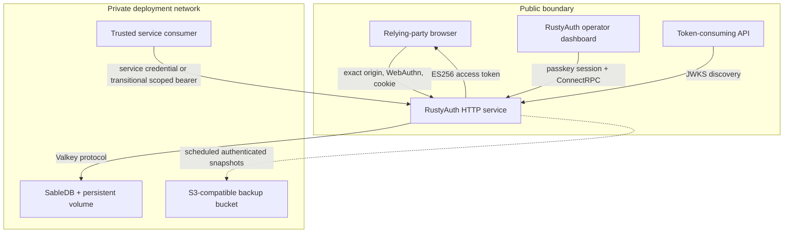
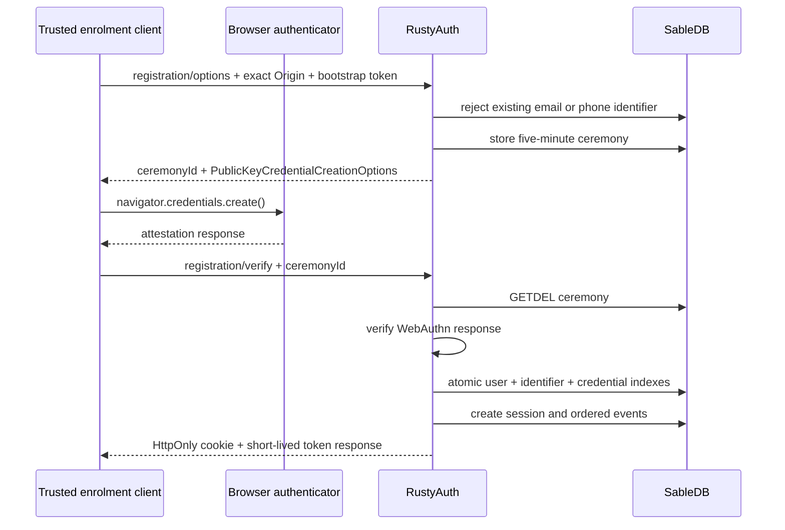

# RustyAuth architecture

This document describes the standalone RustyAuth implementation at version `1.0.0`. Statements about future
functionality are marked explicitly.

## Design goals

RustyAuth keeps the identity boundary small:

- authenticate users with passkeys;
- keep bearer sessions server-side and revocable;
- issue short-lived, audience-bound tokens to downstream services;
- keep durable identity state on private infrastructure; and
- fail closed when configuration, state or authorization is missing.

It intentionally does not decide application roles, subscriptions, entitlements or object ownership.

## Components and trust boundaries

### Browser

The browser performs WebAuthn operations and sends the resulting credential objects to RustyAuth. It receives
an opaque HttpOnly session cookie and a short-lived access JWT in a JSON response. The intended client stores
the JWT only in memory.

### RustyAuth service

One Axum process owns:

- HTTP origin and CORS enforcement;
- transport hardening: response security headers, request timeout and body ceilings;
- WebAuthn relying-party configuration and ceremony verification;
- session creation and validation;
- credential-management policy;
- JWT signing and JWKS publication;
- signing-key lifecycle maintenance;
- logical backup scheduling and recovery commands;
- exact identity discovery and mutations for trusted RPC consumers;
- passkey-session operator policy, organization settings and service-account issuance;
- ordered event creation, polling and streaming; and
- health/readiness reporting.

### SableDB

SableDB is the only online durable store. RustyAuth connects through SableDB's Valkey-compatible protocol
using `redis-rs`. SableDB must have no public endpoint; network reachability is part of the security boundary.

### Downstream consumer

The consumer validates the token signature and policy-relevant claims. Receiving a valid RustyAuth token
proves authentication under the configured relying party; it does not independently grant access to an
application resource.

### Backup bucket

RustyAuth exports a consistent logical snapshot under a mutation gate, compresses it and protects it with a
versioned AES-256-GCM envelope. The envelope header, derived encryption-key ID and payload are authenticated
together. S3 uploads use a transport checksum and succeed only after read-after-write decryption and manifest
verification. The complete state boundary, envelope layout, storage contract and restore procedure are in
[Backups and disaster recovery](BACKUPS.md).

## Stored state

RustyAuth stores JSON values and indexes under these logical key families:

The complete account, identifier, profile, passkey, session and exposure schema is documented in
[Identity data model](IDENTITY_DATA_MODEL.md). This section describes where those records live and how they
participate in the system lifecycle.

| Key family                         | Contents                                                                       | Lifetime                                      |
| ---------------------------------- | ------------------------------------------------------------------------------ | --------------------------------------------- |
| `auth:user:<uuid>`                 | Profile, email/phone identifiers, session version and passkeys                 | Durable                                       |
| `auth:identifier:<type>:<value>`   | Canonical email/phone-to-user index                                            | Durable                                       |
| `auth:email:<email>`               | Compatibility email-to-user index                                              | Durable                                       |
| `auth:credential:<id>`             | Credential-to-user uniqueness index                                            | Durable                                       |
| `auth:registration:<uuid>`         | Server-side WebAuthn registration state                                        | Five minutes, single use                      |
| `auth:authentication:<uuid>`       | Server-side WebAuthn authentication state                                      | Five minutes, single use                      |
| `auth:session:<sha256>`            | Session metadata keyed by a digest of the bearer token                         | Bounded absolute lifetime                     |
| `auth:jwt:keyset:v1`               | Active/staged signing keys, retired public keys and encrypted private material | Durable                                       |
| `auth:event-sequence`              | Monotonic event cursor                                                         | Durable                                       |
| `auth:event:<sequence>`            | Redacted event type, subject and tenant                                        | Durable                                       |
| `auth:organization`                | Single deployment organization with stable UUID and slug                       | Durable                                       |
| `auth:operator:<uuid>`             | Passkey user-to-operator role and authentication metadata                      | Durable                                       |
| `auth:service-account:<uuid>`      | Non-human principal, scopes and redacted credential metadata                   | Durable                                       |
| `auth:service-credential:<sha256>` | Credential-to-account locator keyed by a digest of the raw secret              | Durable until explicit retention policy lands |
| `auth:agent-handoff:<sha256>`      | Development-only one-use handoff                                               | 60 seconds by default                         |

Raw session and handoff bearer values are not used as database keys. Their SHA-256 digests are. Passkey
credential material is serialized through `webauthn-rs`; passwords are not supported or stored.

## Registration flow

Initial registration currently depends on a shared bootstrap token. It is appropriate for controlled
development and provisioning, but it is not a complete public sign-up policy. A production adopter must place
it behind a reviewed invitation or administrative boundary and must never embed it in public browser code.

## Authentication flow

Authentication is identifier-first. A canonical email or E.164 phone number resolves a stable account UUID;
RustyAuth then loads that account's passkeys, creates a five-minute server-side ceremony and verifies the
returned assertion. Identifiers are discovery and contact records, not WebAuthn credentials. Verification
requires the authenticator to report user verification. A non-zero signature counter must advance; regression
fails as a possible cloned credential.

After success, RustyAuth updates the stored passkey state and last-used time, creates a session and returns
both the session cookie and an access token.

## Session model

Session tokens contain 32 random bytes encoded with unpadded Base64URL. The cookie is:

- `HttpOnly`;
- `SameSite=Strict`;
- scoped to `/`;
- `Secure` in production; and
- bounded by the configured absolute lifetime.

Every authenticated request checks:

1. exact request origin;
2. session existence;
3. absolute expiry;
4. idle expiry;
5. referenced user existence;
6. equality between the user's and session's `session_version`; and
7. that the session's originating passkey is still attached to the account.

Any failed check deletes the session record before rejecting the request, so a session invalidated once stays
invalidated. Successful validation advances `last_seen_at`; durable touches are coalesced to a bounded cadence
so the authenticated read path does not rewrite the session on every request. Coalescing may end an idle
session by up to five minutes (or one sixth of a shorter idle window) early, but never extends its idle or
absolute security boundary. Sign-out deletes
the current session. The data model supports invalidating sessions by advancing a user's session version; the
public revoke-all operation uses that mechanism and requires a recent passkey-backed session.

### Passkey revocation ends the sessions that passkey created

Check 7 is what makes credential revocation a containment control rather than a bookkeeping change. A session
records the `current_credential_id` it was created with; when that credential is no longer in the account's
passkey list, the session is deleted on its next use.

Previously a revoked passkey left its sessions alive until `AUTH_SESSION_ABSOLUTE_SECONDS` elapsed — up to
seven days at the default. An operator responding to a lost or stolen authenticator removed the credential,
saw it disappear from the dashboard, and the thief's existing browser session kept working. The control the
interface presented as the stop for a stolen device did not stop it.

The guarantee is now: revoking a passkey ends every session created with it, on that session's next request.
It is not a revoke-all — other passkeys on the same account keep their sessions, which is the intended
behaviour when a user retires one of several authenticators. Sessions with no originating credential
(development agent handoffs) are unaffected.

## Credential-management policy

An authenticated account can list passkeys. Adding a passkey requires a recently user-verified passkey session
and the resulting ceremony is bound to that exact session. Renaming requires a passkey session; removing
requires a passkey sign-in or dedicated step-up completed within the last five minutes and cannot remove the
final passkey. The step-up ceremony is bound to the exact account and initiating session, is single-use and
updates the durable session only after the authenticator verifies the user. Agent handoff sessions do not
satisfy any identity-mutation requirement.

## Account identity model

An account is anchored by a UUID and may contain up to 20 globally unique email and phone identifiers plus
multiple passkeys. Exactly one identifier is primary. Existing single-email user records are hydrated into
this model on read, and the legacy email index remains supported, so the change does not invalidate accounts
or passkeys already stored by RustyAuth.

Basic profile data consists of optional given, family and display names. It labels WebAuthn registration but
never replaces the UUID user handle. Adding, removing or changing the primary identifier requires a recent
passkey session; updating profile presentation requires a passkey session. The final identifier cannot be
removed.

See [Identity data model](IDENTITY_DATA_MODEL.md) for every stored field, canonicalization rule, legacy
compatibility field, metadata projection and deliberately excluded data class.

## Token model

RustyAuth creates an EC P-256 signing key on first boot. Its PKCS#8 private bytes are encrypted with
AES-256-GCM under `AUTH_MASTER_KEY_HEX` before storage. The public key is exposed as JWK.

JWTs use `alg=ES256`, `typ=JWT` and a `kid`. Claims are:

| Claim             | Meaning                                                |
| ----------------- | ------------------------------------------------------ |
| `iss`             | Configured RustyAuth issuer                            |
| `aud`             | Configured downstream audience                         |
| `sub`             | RustyAuth user UUID                                    |
| `exp`, `iat`      | Expiry and issue time                                  |
| `jti`             | Unique token ID                                        |
| `sid`             | Durable session UUID                                   |
| `token_type`      | `spacetime-access` in the current integration          |
| `tenant_id`       | Configured instance tenant                             |
| `amr`             | `hwk` for passkey or `agent` for a development handoff |
| `auth_time`       | Session creation time                                  |
| `session_version` | User/session invalidation generation                   |

Email, phone, profile and verification state are returned beside the token but are not JWT claims. Consumers
must not infer authorization from an unverified response field.

Signing keys have a staged, active and retired lifecycle. A replacement public key is published for at least
`AUTH_SIGNING_KEY_PREPUBLISH_SECONDS` before activation. The previous public key remains in JWKS for
`AUTH_SIGNING_KEY_OVERLAP_SECONDS`, which cannot be configured below the maximum access token lifetime plus
the five-minute JWKS cache allowance. Retired private material is discarded.

The maintenance loop rotates automatically and uses a short SableDB lease to avoid duplicate work across
processes. `keys rotate` triggers the same safe staged lifecycle. Master-key rotation is independent:
supplying the new active master key plus the old key in the previous-key list causes private signing material
to be rewrapped without changing its `kid`.

## Backup and restore model

This section is the architectural summary. [Backups and disaster recovery](BACKUPS.md) is the normative,
field-level operator and developer reference.

The backup manifest covers sorted durable records, record-family counts, a canonical content digest and the
ordered-event sequence. Validation rejects duplicate or unsupported keys, tenant mismatch, orphaned user
indexes and credentials, malformed expiry policy, missing signing state and event gaps. Ceremony,
agent-handoff, maintenance-lock and restore-marker records are not exported.

Backups run immediately on startup and then on a configurable interval. An in-process operation lock plus a
SableDB lease prevents overlapping snapshots. Restore is an offline command that accepts only an empty
`auth:*` namespace. Sessions are skipped and each user's `session_version` is advanced unless the operator
explicitly supplies `--preserve-sessions`. A durable in-progress marker blocks normal startup until
signing-key rotation and the recovery event both complete.

## Events

Events contain only a sequence, UUID, configured tenant ID, event type, optional user UUID, timestamp and
redacted JSON object. They deliberately exclude passkey assertions, cookies, JWTs, handoff codes and
email-link tokens.

`GET /v1/events?after=N` returns at most 500 subsequent records. It is authenticated by the bootstrap token.
`rustyauth.events.v1.AuthEventService/Subscribe` provides cursor-based replay and follow over Connect,
gRPC-Web and gRPC using either the separately scoped legacy event RPC token or a short-lived service-account
JWT carrying `events.read`. Consumers own durable acknowledgement by committing their sequence only after
their own transaction commits. Bounded retention refuses to prune beyond a lagging webhook or analytics
projector cursor.

The webhook worker reads the same ordered log. Each destination owns a cursor and durable delivery history;
successful or terminal deliveries advance the cursor, while retryable transport, `408`, `425`, `429` and `5xx`
responses use bounded exponential backoff. Requests carry a delivery ID, event type, timestamp and HMAC-SHA256
signature over the timestamp and exact body. Redirects are disabled. Replay is possible while the source event
remains retained.

## Operator and service RPC

`rustyauth.identity.v1.IdentityService` is the trusted control-plane boundary. It exposes exact identity
search, complete safe account reads, profile replacement, email/phone lifecycle operations, and passkey
rename/revoke operations. It accepts the transitional identity bearer, a short-lived service-account JWT with
the exact `identity.read` or `identity.write` scope, or an appropriately privileged passkey operator session.
Passkey responses are projected through a metadata-only type before protobuf encoding; stored WebAuthn
credentials, public keys and counters never cross the boundary. New credential material still requires a
WebAuthn registration ceremony.

Attaching an identifier and asserting the account controls it are separated. `AddIdentifier` rejects a
`verified: true` request outright and always stores the identifier unverified; only
`SetIdentifierVerification`, at the administer capability, can mark one verified. Verification feeds the
`email_verified` claim and operator bootstrap, so it is an identity-proofing decision rather than routine
support work.

`rustyauth.organization.v1.OrganizationService` and administrative
`rustyauth.service_accounts.v1.ServiceAccountService` methods require an exact-origin session whose
`auth_method` is `passkey`. Owner and administrator roles manage organization and service-account state,
support may manage identity records, and auditor remains read-only. Local-agent handoffs cannot become
operators.

### Method authorization is an exhaustive table

Every RPC method's policy is named individually in `METHOD_POLICIES`. Resolution strips a known service prefix
and looks the method up by exact name; a method with no entry is denied. Service-account authorization
performs a second exact method-to-scope lookup: event streaming requires `events.read`, safe identity reads
require `identity.read`, supported identity mutations require `identity.write`, aggregate metrics require
`metrics.read`, and webhook operations require `webhooks.manage`. `SetIdentifierVerification` remains
operator-only. A unit test reads every served `.proto` source and asserts that each method has one live
policy, so widening the surface cannot happen silently.

Streaming resolves against the same table but accepts only bearer policies. The operator check is async and
the streaming hook is not, so a method that needs an operator session must remain unary rather than quietly
downgrade to no check.

### First operator

Browser bootstrap requires the passkey account to hold a verified email identifier from
`AUTH_OPERATOR_EMAILS`. Production never marks a self-service identifier verified, and verifying one is itself
an administer-capability operator action, so on an empty deployment the two requirements form a cycle: no
operator can exist until an address is verified, and no address can be verified until an operator exists.

`rustyauth operator promote <user-id> <role>` breaks the cycle from the host. It writes the operator record
for a named account and nothing else. The cost is deliberate — creating the first Owner requires privileged
container-command access to the deployment (the production image has no shell) rather than control of an
inbox, which is a materially harder thing for an attacker to
obtain than an unclaimed email address.

It takes a user id rather than an address because the address is not a safe way to name an account here. Any
enrolled account can attach an unclaimed identifier to itself through the self-service API, so a command that
resolved the allowlisted address would grant Owner to whichever account claimed it first — turning the
administrator's own bootstrap into the attacker's escalation. `operator find <email>` reports every account
holding an address, with when each claimed it and whether it is verified, so the id being promoted is one a
human has looked at. `operator demote <user-id>` withdraws a grant; the allowlist cannot, because a stored
operator record is honoured before the allowlist is consulted.

Service-account secrets are high-entropy random `rsa_` values shown once. SableDB stores only their SHA-256
locator and a six-character display hint. A live, unexpired credential can be exchanged for a short-lived
ES256 JWT containing only the service-account subject and an allowed subset of stored scopes.

## Transport hardening

The dashboard is an administrative surface served from the same origin as the authentication API, so browser
policy is part of the trust boundary rather than a deployment nicety.

RustyAuth sets `Content-Security-Policy`, `X-Frame-Options`, `Cross-Origin-Opener-Policy`,
`Cross-Origin-Resource-Policy`, `Permissions-Policy`, `X-Content-Type-Options` and `Referrer-Policy` on every
response, and `Strict-Transport-Security` in production only — pinning HSTS from a `http://localhost`
development origin would poison the browser for that host long past the session. The dashboard loads no
third-party code, so the CSP can deny inline and remote script, frame ancestors, `base` rewriting, plugins and
non-self `connect-src` outright: an injected script has neither a place to execute nor a destination to
exfiltrate to. Every header is set only when absent, so a deliberate proxy-level policy still wins.

Three ceilings bound a single request: a 30-second timeout, a 256 KiB REST body limit and a 64 KiB RPC body
limit. The timeout is the one the size limits cannot substitute for — a client that dribbles a small body
slowly holds a connection indefinitely, and size caps never expire.

Shutdown is bounded at 20 seconds. Background signing and backup workers watch a shutdown channel and exit on
their own, and a backup mid-upload should checkpoint rather than die mid-write; the bound stops one stuck
worker, or a single long-lived event stream, from blocking every deploy indefinitely.

Sensitive-header marking is the outermost layer, so the tracing layer beneath it never observes raw
`Authorization`, `Cookie`, `x-bootstrap-token` or `Set-Cookie` values.

## Tenancy

Version `1.0.0` is one configured tenant per RustyAuth instance. Tokens and events carry `AUTH_TENANT_ID`, but
user/session/database keys are not tenant-prefixed. Do not point multiple independently trusted tenants at one
SableDB namespace.

The active roadmap keeps this single-tenant data-plane boundary while adding a
[fleet control plane](FLEET_CONTROL_PLANE.md) that manages many isolated RustyAuth deployments from one Dioxus
dashboard. It does not change the data-plane isolation rule or authorize direct dashboard access to databases.

The `console/` Dioxus application is the sole dashboard implementation for standalone web, separately deployed
Fleet web, desktop and later mobile. Fleet web uses live passkey sessions and binary Connect for its durable
hierarchy, audit and pairing journeys. The local realm operations screens retain preview projections until
their RPC parity gate is complete. The migration and transport decision is recorded in
[ADR 0003](decisions/0003-unified-dioxus-fleet-control-plane.md).

## Fleet Analytics boundary

Fleet Analytics is an optional derived plane, not part of the authentication path. Each managed realm will
project bounded, closed five-minute snapshots into its own SableDB outbox and retry complete revisions over a
realm-initiated authenticated channel. The central gateway resolves the authenticated realm in Fleet SableDB
and stamps environment, project, organization and assignment epoch; a realm-supplied hierarchy assertion is
never trusted.

Accepted realm buckets are canonical analytical facts. Environment, project, organization and authorized fleet
results derive directly from those facts using checked sums, ratio-of-sums and merged cumulative histograms.
They are not cascades of rounded child aggregates. Fleet SableDB remains authoritative for hierarchy,
authorization, connections, ingestion cursors and accepted revisions. The preferred GreptimeDB store is
private behind an internal adapter and is authoritative only for accepted analytical facts and derived
rollups.

The normal delivery path is authenticated gRPC. Signed, Zstandard Parquet in an explicitly approved
S3-compatible bucket is a cold repair, backfill and portability path; product queries do not introspect every
foreign bucket. Neither path permits raw identity events, subject identifiers, database credentials or
caller-defined labels. An analytics outage changes freshness and coverage only and must never block realm
sign-in, session validation, token issuance or recovery.

The [Fleet Analytics delivery program](FLEET_ANALYTICS.md), [V1 semantic contract](FLEET_ANALYTICS_V1.md) and
[developer guide](https://rustyauth.dev/docs/fleet-analytics) define the complete architecture, rollout and
compatibility boundary. M9 contracts and the M10 local projection, standalone MetricsService, durable outbox,
authenticated realm export and Fleet acceptance ledger are complete. The private GreptimeDB adapter,
database-namespaced hourly/daily materialization, signed Parquet recovery and hierarchical AnalyticsService
are supported in the `1.0.0` V1 tier. Extended qualification, independent-review and canary evidence continues
under the Analytics runbook.

## Concurrency and scaling

Multi-key user and credential writes use atomic SableDB pipelines. A process-local async mutex serializes
compound mutations within one RustyAuth process. That mutex does not coordinate multiple replicas. Run one
writer instance until cross-instance transaction/locking behavior has dedicated tests and an explicit design.

## Failure behavior

RustyAuth rejects startup or requests when required state cannot be validated. Examples include:

- an unset or unrecognized `AUTH_ENV`;
- a master or backup encryption key whose 32 bytes are all identical;
- invalid or non-HTTPS production origins;
- an RP ID that does not exactly match the application origin host;
- a plaintext production SableDB URL outside Railway private networking;
- partial backup configuration;
- an RPC method with no entry in the authorization table;
- a backup whose authenticated envelope, manifest or tenant cannot be validated;
- a restore destination that contains auth state or an incomplete restore marker;
- missing, expired or replayed ceremony state;
- missing or expired sessions;
- credential/account mismatches; and
- stored signing material that cannot be decrypted with the configured master key.

Internal errors are logged server-side and returned to callers as a generic fail-closed error.

## Known architectural gaps

See [SECURITY.md](../SECURITY.md), the README status matrix and the
[1.0.0 release-readiness record](RELEASE_READINESS.md). RustyAuth fences its supported one-writer topology
with a renewable datastore lease; active/active mutation remains outside the 1.0 contract. The largest
continuous assurance programs cover infrastructure egress enforcement, supported-web browser/authenticator and
published-image drills, Analytics qualification/canary evidence and independent review. Native clients remain
unsupported previews outside the `1.0.0` contract and are separately gated for a later release.
