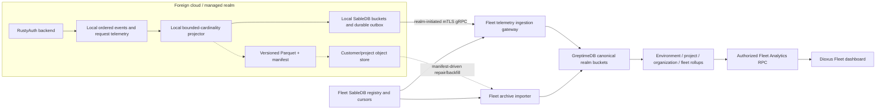

# Federated Fleet Analytics delivery program

**Status:** Planned post-Fleet program; implementation is inactive until the activation gate below passes

**Updated:** 8 August 2026

**Controlling decision:**
[ADR 0004: Federated Fleet Analytics with trusted rollup ingestion](decisions/0004-federated-fleet-analytics.md)

## Purpose

Federated Fleet Analytics gives an authorized operator one drillable view of authentication health across
isolated RustyAuth realms without merging their identity databases or making authentication depend on the
central control plane.

The product hierarchy is:

```text
Fleet
└── Organization
    └── Project
        └── Environment
            └── Realm connection
```

Every level presents the same bounded operational vocabulary: authentication volume and outcome, latency,
registration completion, session and token issuance, service-account activity, delivery health, backup and
signing health, and reporting coverage. An operator can drill from a fleet-wide regression to one realm while
the realm remains authoritative for users, passkeys, sessions, keys, events and recovery.

The preferred central analytical store is GreptimeDB. That choice remains behind an internal analytics-store
port and must pass the qualification gates in this program. The Fleet protocol and Parquet interchange format
are the durable product contracts; GreptimeDB SQL and storage layout are not public contracts.

## Activation gate

Product implementation starts only after the main delivery roadmap's M8 exit gate is complete and the release
status matrix identifies Fleet as shipped. Specifically, all of the following must be true:

- stable realm IDs survive restart, restore, upgrade, disconnect and re-pair;
- organization, project, environment and connection records are durable and authorization-tested;
- public-endpoint and outbound-connector modes are shipped with credential rotation and revocation;
- partial, stale and offline realm states are represented correctly in the live Dioxus product;
- Fleet and every realm have independently qualified backup and clean-room restore procedures;
- version and capability negotiation is additive and exercised against supported skew;
- production remote mutations, recovery drills and the Fleet threat assessment have passed;
- published dashboard, control-plane and realm images are independently deployable; and
- the README and release notes no longer describe Fleet as preview or planned.

Before activation, this document and ADR may be refined and read-only benchmarks may be run. No production
realm should emit central telemetry and no customer data should be placed in a central analytics store merely
to prepare for the feature.

## Product outcomes

The first generally available version must let authorized operators:

- view authentication attempts, success rate, failures and latency at realm, environment, project,
  organization and fleet scope;
- move between 24-hour, 7-day and 28-day views with honest comparison periods;
- see how many realms were expected, how many reported, which are stale and the last complete window;
- drill from a higher-level anomaly to the contributing child scopes;
- distinguish zero activity from missing telemetry;
- compare selected sibling environments without obtaining identity records or database credentials;
- recover central analytics from the realms' durable rollup stream or approved Parquet archives; and
- disconnect a realm without affecting local authentication or local operational history.

## Non-goals

The initial program does not:

- centralize complete customer identity databases;
- make raw identity events a required input to Fleet analytics;
- correlate the same human across realms, organizations or WebAuthn RP IDs;
- expose GreptimeDB, object-store credentials or analytics SQL to Dioxus clients;
- let a realm assert its own organization, project or environment attribution;
- compute customer-visible benchmarks from other organizations without a separate opt-in privacy decision;
- provide arbitrary cross-organization SQL or unrestricted event search;
- make authentication, token issuance, session validation or recovery depend on analytics availability; or
- replace the local ordered event log, local dashboard or break-glass operation.

## Architecture



### Trust boundaries

1. A realm authenticates as one stable `realm_id` and `connection_id` over its existing management channel.
2. The Fleet ingestion gateway resolves `realm_id -> environment -> project -> organization` from Fleet
   SableDB. Hierarchy IDs supplied inside a realm payload are ignored or rejected.
3. Only the ingestion gateway and analytics worker write to GreptimeDB. Realms, Dioxus clients and the
   dashboard gateway never receive GreptimeDB credentials.
4. Only the control plane queries GreptimeDB for product traffic. It applies the operator's stored Fleet role
   bindings before constructing a bounded query.
5. Fleet SableDB remains authoritative for hierarchy, authorization, connection state, ingestion cursors and
   manifest processing. GreptimeDB is authoritative only for accepted analytical facts and derived rollups.
6. A central analytics failure changes freshness and coverage; it never changes a realm's authentication
   behavior.

## Delivery paths

### Hot path: outbound gRPC rollups

The normal serving path transports complete bucket snapshots, not per-event increments. A full snapshot is
safe to retry and avoids double-counting after ambiguous network failures.

The connector carries a versioned `TelemetryBucketBatch` payload either inside the existing bidirectional
connector frame or through a dedicated streaming RPC sharing the same connection identity and interceptors.
The exact service shape is locked in milestone A1 after connector load testing.

Each bucket contains:

```text
realm_id                 authenticated context; repeated for validation
assignment_epoch         immutable hierarchy-attribution epoch
bucket_start             UTC, aligned to five minutes
bucket_width_seconds     300 in v1
revision                 monotonically increasing within the bucket
first_event_sequence     first contributing durable event, when applicable
last_event_sequence      highest contributing durable event
metric_schema_version    exact semantic contract
values                   fixed counters, gauges and histogram buckets
closed                   whether the realm considers the window final
```

The realm must write the bucket, telemetry cursor and outbox record in one atomic local mutation. It deletes
the outbox record only after receiving an acknowledgement for the exact bucket key and revision.

The central gateway:

1. authenticates the connection and resolves the stored hierarchy;
2. validates schema version, UTC alignment, dimensions, monotonic sequence and revision bounds;
3. rejects unknown labels, impossible counter relationships and resource-limit violations;
4. durably queues and serializes the bucket on its realm stream, with a Fleet SableDB claim that rejects a
   stale or concurrently superseded revision;
5. stamps trusted hierarchy IDs and the current `assignment_epoch`;
6. writes the canonical GreptimeDB row idempotently;
7. commits the accepted revision and source watermark in Fleet SableDB; and
8. acknowledges the exact accepted revision.

A crash between steps 6 and 7 is recovered by retrying the same complete snapshot. The GreptimeDB primary-key
tags plus time index identify one canonical realm bucket, and the per-realm worker does not advance to a newer
revision until the previous write is committed or its fenced claim is safely recovered. Multi-worker fencing
must pass the A3 concurrency suite before the ingestion gateway scales beyond its qualified writer topology.

### Cold path: Parquet archive and backfill

Parquet is a replay and portability path, not the normal dashboard query path. Two separately versioned
schemas are planned:

- `rustyauth-metric-bucket-v1`: the same bounded rollup facts sent over gRPC; and
- `rustyauth-redacted-event-v1`: optional redacted event summaries, disabled by default.

Recommended object layout:

```text
rustyauth-telemetry/
└── v1/
    └── realm=<stable-realm-id>/
        └── year=2026/month=08/day=08/hour=14/
            ├── metric-buckets-000001000-000001999.parquet
            └── metric-buckets-000001000-000001999.manifest.json
```

The object is uploaded first and the signed manifest last. The manifest contains schema version, realm ID,
assignment epoch, first and last source sequence, minimum and maximum timestamp, row count, byte length,
content hash and object identity.

The importer consumes explicit manifests; it does not continuously list every foreign bucket. It uses a
short-lived, prefix-scoped credential, customer-initiated presigned transfer or approved replication into a
central landing bucket. It verifies the manifest before `COPY FROM` into the canonical GreptimeDB table and
records the manifest ID in Fleet SableDB so reprocessing is idempotent.

GreptimeDB external Parquet tables may be used for operator-approved exploration and repair. Routine Fleet
views do not fan out to foreign buckets because bucket credentials, file listing, schema drift, cross-cloud
latency, egress and missing-source interpretation would become part of every dashboard request.

## Metric semantics

### Canonical interval

- V1 windows are five-minute, UTC-aligned, left-closed and right-open.
- A realm may send provisional revisions while a window is open, but only closed windows contribute to
  long-term materialized rollups.
- The default close grace is two minutes after the window ends.
- A late correction increments `revision` and resends the entire bucket.
- Event time, not central receipt time, selects the bucket. Receipt time is retained separately for freshness.
- Clock drift outside the configured tolerance rejects or quarantines the bucket and degrades connection
  health; the gateway never silently rewrites event time.

### V1 metric catalogue

| Family                 | Measures                                                                                             | Aggregation rule                                                         |
| ---------------------- | ---------------------------------------------------------------------------------------------------- | ------------------------------------------------------------------------ |
| Authentication         | attempts, successes, failures, denials                                                               | Sum counts; derive rates from summed numerators and denominators         |
| Authentication latency | count, sum and fixed histogram buckets                                                               | Merge histogram counts; calculate p50/p95/p99 after merging              |
| Registration funnel    | options started, ceremonies opened, assertions returned, registrations completed, expired challenges | Sum each stage; derive conversion rates from summed stages               |
| Sessions and tokens    | sessions created, sessions revoked, user tokens, service tokens                                      | Sum counts                                                               |
| Service accounts       | calls, successes, denials, credential rotations                                                      | Sum counts                                                               |
| Webhooks               | deliveries, successes, failures, latency histogram, backlog gauge                                    | Sum events and histograms; use the latest gauge per realm before summing |
| API and storage        | bounded error classes, request latency histogram, SableDB latency histogram                          | Sum errors and merge histograms                                          |
| Realm health           | readiness, signing-key age, backup age, connector lag                                                | Use latest value per realm; derive coverage separately                   |

Rates and percentiles are never averaged across children. A project success rate is:

```text
sum(successes for contributing realm buckets) / sum(attempts for contributing realm buckets)
```

An organization p95 is calculated from the merged latency histogram. It is never the average or maximum of
environment p95 values.

`active_users` is not a fleet-wide unique-person metric. V1 exposes `active_accounts_by_realm` and may sum it
as `active_realm_accounts` with an explicit duplication warning. Cross-realm person correlation would require
a separate identity, privacy and product decision.

### Allowed dimensions

V1 dimensions are closed enums owned by the protocol. Expected examples are `outcome`, `auth_flow`,
`principal_kind`, `token_kind` and `error_class`. The control plane adds organization, project, environment,
realm and assignment epoch.

The following are forbidden as metric dimensions or values:

- user, subject, account, identifier, credential or session IDs;
- email addresses, phone numbers, names, IP addresses or user-agent strings;
- tokens, cookies, challenges, assertions, public keys or secret hints;
- webhook URLs, arbitrary request paths, arbitrary error strings or caller-supplied labels; and
- any value whose cardinality is not bounded by the metric schema.

## Hierarchy attribution and re-parenting

The central registry creates an `assignment_epoch` whenever a realm's environment assignment changes. Every
accepted bucket is stamped with the IDs and epoch valid when it is accepted.

- Historical facts retain their original attribution.
- New facts use the new epoch.
- An archive manifest includes the epoch it was created under, but the importer validates it against Fleet
  history before accepting it.
- A deliberate historical re-attribution is an audited backfill operation, never a side effect of editing a
  project or environment.
- Archived projects and environments remain queryable for authorized historical views until retention removes
  their analytical facts.

## Canonical and derived storage

### GreptimeDB tables

The initial physical model uses a small number of wide tables to limit series cardinality:

| Table                   | Grain                                            | Purpose                                            |
| ----------------------- | ------------------------------------------------ | -------------------------------------------------- |
| `auth_realm_5m`         | realm + assignment epoch + five-minute window    | Canonical counters and latency histogram           |
| `auth_failure_realm_5m` | realm + bounded error class + five-minute window | Failure breakdown                                  |
| `realm_health_1m`       | realm + one-minute observation                   | Latest health and freshness signals                |
| `auth_scope_1h`         | scope kind + scope ID + hour                     | Materialized environment/project/org/fleet history |
| `auth_scope_1d`         | scope kind + scope ID + day                      | Long-range history                                 |

Primary-key tags are ordered for the dominant time-and-scope filters. High-cardinality request or event IDs
remain fields or outside GreptimeDB entirely. Table schemas, partition rules and indexes are fixed by measured
query plans, not copied blindly from the logical model.

The canonical realm table is the sole numerical source of truth. Higher-level results derive directly from
canonical realm buckets, not from a chain of environment -> project -> organization sums. That rule prevents
double-counting and makes a repair deterministic.

### Materialization strategy

The first release queries canonical five-minute rows for 24-hour and 7-day views and uses a short bounded
control-plane response cache. Hourly and daily materializations are added for 28-day and longer views after
the canonical path is correct.

GreptimeDB Flow is the preferred continuous-aggregation mechanism once qualification proves that finalized
bucket ingestion and correction behavior are safe. Flow supports time-window aggregation from one source table
and does not currently provide the joins needed to resolve Fleet hierarchy; hierarchy stamping therefore
happens before ingestion. A deterministic analytics-worker repair job can recompute an affected hour or day
from canonical buckets after a late correction, schema migration or restored archive.

Foreign external tables are never Flow sources for product-serving rollups.

### Fleet SableDB state

Fleet SableDB stores only coordination and authority:

- highest accepted bucket revision and source sequence per realm/window;
- expected, reporting, stale and disabled realm sets;
- hierarchy assignment epochs;
- processed Parquet manifest IDs and hashes;
- organization telemetry policy and retention selection;
- repair/backfill jobs and their idempotency state; and
- redacted audit records for policy changes, imports, repairs and purges.

It does not duplicate the analytical time series.

## Retention and residency baseline

| Data class                          | Default         | Notes                                                                       |
| ----------------------------------- | --------------- | --------------------------------------------------------------------------- |
| Canonical five-minute realm buckets | 35 days         | Supports 28-day views plus repair margin                                    |
| Hourly scope rollups                | 400 days        | Supports year-over-year operational comparison                              |
| Daily scope rollups                 | 25 months       | Longer retention requires an explicit product/compliance policy             |
| Realm health samples                | 90 days         | Latest health remains separately available in Fleet SableDB                 |
| Central raw event summaries         | Disabled        | If enabled, default maximum is 30 days and subject identifiers are excluded |
| Customer-owned Parquet              | Customer policy | Fleet records only approved manifest metadata and processing state          |

An organization may select a shorter permitted retention. Increasing retention beyond the supported baseline
is an enterprise/compliance decision with cost and deletion qualification. Disconnect stops new ingestion
immediately and starts the configured projection-retention policy; immediate purge is an explicit, audited
operation.

If policy forbids event export, only anonymous bounded rollups leave the project. Raw events remain in the
realm's local event log or customer-owned archive.

## Public Fleet Analytics API

A dedicated Protobuf service is planned under `rustyauth.analytics.v1`. Dioxus never submits SQL. The bounded
surface is expected to include:

```text
GetAnalyticsOverview
QueryMetricSeries
GetAuthenticationFunnel
GetFailureBreakdown
GetReportingCoverage
CompareScopes
```

Every request carries one typed scope:

```text
Fleet | Organization | Project | Environment | Realm
```

The server derives accessible scope from the authenticated operator and stored role bindings. A requested
scope ID never grants access. Range, granularity, metric, comparison and dimension filters are enums or
bounded messages. Responses include:

```text
requested range and effective granularity
calculated_at
last_complete_window
expected_realms
reporting_realms
stale_realms
coverage ratio
partial flag and source warnings
metric values or series
```

All-organization aggregates require a distinct Fleet-platform permission and are never returned to an ordinary
organization owner. Customer benchmarking is outside V1.

## Dashboard information architecture

### Fleet overview

- global authentication volume, success rate and latency;
- healthy, degraded, stale and offline realm counts;
- organizations with the largest absolute failure increase;
- release/version correlation where deployment metadata is available; and
- a prominent coverage statement for every selected window.

### Organization and project

- the same headline metrics within authorized scope;
- child contribution table ranked by attempts, failure delta or latency;
- environment comparison with production/staging labels;
- drill-down without exposing child identities; and
- retention, export and data-residency policy status.

### Environment and realm

- five-minute charts and bounded failure classes;
- connector lag, source sequence, last complete bucket and last backfill;
- local-versus-central freshness status;
- deployment, backup and signing health correlations; and
- an explicit link to on-demand realm operations, still routed through the control plane.

Loading, zero, partial, stale, unauthorized and unsupported-capability states receive separate UI fixtures and
tests. Missing data is never rendered as zero.

## Reliability model

### Delivery guarantees

- Realm export and archive processing are at least once.
- Complete bucket snapshots plus monotonic revisions make accepted writes idempotent.
- An acknowledgement names the exact bucket key, revision and accepted source watermark.
- Unknown acknowledgements, stale revisions, sequence regression and assignment mismatch fail closed.
- Backpressure never blocks authentication; it grows a bounded local outbox and raises a degraded telemetry
  health signal.
- When the outbox limit is approached, required rollup snapshots are compacted by key before optional archive
  work is discarded. Loss policy is explicit and observable.

### Coverage

GreptimeDB can report what arrived; only the Fleet registry knows what should have arrived. Every query joins
analytical results with expected connection state inside the Rust control plane and returns coverage metadata.

A realm is not counted as zero when:

- it lacks the required analytics capability;
- its connector is offline;
- its last accepted bucket is older than the query's completeness watermark;
- it is quarantined for clock, schema or integrity failure; or
- organization policy disables central analytics.

### Recovery

Clean-room recovery restores:

1. Fleet SableDB hierarchy, policy, cursors and manifest state;
2. the GreptimeDB catalog and durable object-store data;
3. missing canonical windows from realm gRPC replay or approved Parquet archives; and
4. hourly and daily rollups from canonical five-minute rows.

No recovery procedure contacts a realm database directly. If both central analytical storage and its backup
are lost, realms remain operational and may replay only the telemetry still covered by their local retention.

## Security and abuse cases

The analytics threat review must cover at least:

- a realm claiming another realm or hierarchy;
- cross-organization query leakage and cache-key confusion;
- forged, replayed, reordered or regressed bucket revisions;
- cardinality amplification through labels, error strings or arbitrary paths;
- malicious Parquet, schema confusion, decompression bombs and manifest/object substitution;
- SSRF or credential leakage through customer object-store endpoints;
- one organization's ingest exhausting shared memory, CPU, series or query budgets;
- timing or cohort attacks against fleet/global results;
- unauthorized raw-event enablement or retention extension;
- re-parenting a realm to rewrite historical attribution;
- GreptimeDB administrative or dashboard exposure; and
- control-plane compromise followed by cross-customer analytical exfiltration.

Required controls include per-realm quotas, fixed schemas, message and batch limits, mTLS workload identity,
signed connector frames where specified by Fleet, private GreptimeDB networking, separate ingest/query service
identities, secret-manager credentials, encrypted object storage, operator audit, organization-scoped cache
keys and exhaustive negative-authorization tests.

GreptimeDB open source currently provides basic authentication and user-level read/write access; stronger
defense-in-depth may require database-per-organization layouts, an enterprise/managed deployment or strict
network/service isolation. The production topology is selected during A3 and cannot rely on Dioxus or
GreptimeDB's own dashboard as an authorization boundary.

## Operational targets and qualification matrix

Initial service objectives, finalized from A1 benchmarks, are:

- no acknowledged closed bucket is lost;
- p95 central acceptance occurs within two minutes of a healthy realm sending a closed bucket;
- a healthy realm's event-to-dashboard delay is no more than one bucket plus close grace under normal load;
- p95 24-hour environment and project queries complete within 500 ms at the medium qualification tier;
- p95 28-day organization queries complete within 2 seconds at the medium tier;
- every response reports exact expected/reporting counts from one consistent registry snapshot; and
- analytics outage or overload adds no measurable latency to realm authentication endpoints.

Qualification tiers use the wide canonical bucket model and measured dimension expansion:

| Tier   | Organizations | Realms | Canonical buckets/day before bounded breakdowns |
| ------ | ------------: | -----: | ----------------------------------------------: |
| Small  |            10 |    100 |                                          28,800 |
| Medium |           100 |  1,000 |                                         288,000 |
| Large  |         1,000 | 10,000 |                                       2,880,000 |

Tests must measure ingestion, correction, 24-hour, 28-day, 400-day, cold-start and concurrent dashboard
queries. Results determine partitioning, indexes, materialization and whether standalone, distributed or
managed GreptimeDB is supported for each product tier.

The chaos matrix includes:

- connector interruption for minutes, hours and longer than the outbox target;
- duplicate, reordered and late bucket revisions;
- GreptimeDB unavailable before and after a write acknowledgement boundary;
- Fleet SableDB unavailable while GreptimeDB remains available and the reverse;
- object-store timeout, partial upload, wrong checksum and expired credentials;
- realm clock drift and sequence reset after incorrect restore;
- schema-version skew across supported realm releases;
- hierarchy re-parenting during an open bucket;
- backfill concurrent with live ingestion; and
- clean-room restore followed by replay and materialized-rollup rebuild.

## Delivery roadmap

### A0 — Activation and decision refresh

**State:** gated by main-roadmap M8

- Verify every activation prerequisite against shipped artifacts and release notes.
- Revalidate ADR 0004 against the final connector, registry, role and recovery implementation.
- Re-run GreptimeDB, SableDB-only and object-store cost/operations comparisons using current releases.
- Lock supported product tiers, residency modes and whether production uses self-hosted or managed GreptimeDB.
- Complete the analytics-specific data protection and threat-model kickoff.

**Exit gate:** Fleet is shipped; ADR 0004 is accepted or replaced; analytics has named service boundaries,
owners, budgets and a release target without weakening Fleet availability.

### A1 — Semantic and protocol lock

- Freeze metric names, units, histogram boundaries, allowed dimensions and forbidden data.
- Define five-minute bucket closure, provisional revision, correction and clock-skew behavior.
- Add versioned telemetry bucket, acknowledgement, coverage and archive-manifest Protobuf messages.
- Add `telemetry.rollups.v1` and `telemetry.archive-manifest.v1` capabilities.
- Specify canonical Parquet schemas and golden fixtures.
- Add compatibility tests across the oldest and newest supported Fleet releases.

**Exit gate:** identical fixtures produce identical bucket bytes, Parquet rows and aggregate answers in Rust;
unknown dimensions and incompatible versions fail closed.

### A2 — Realm projection and durable export

- Instrument request/ceremony paths required by the metric catalogue without logging secrets.
- Implement the local projector, bucket snapshots, revision state and bounded SableDB outbox.
- Expose local metrics through the standalone MetricsService before enabling Fleet export.
- Add connector transport, acknowledgement, retry, compaction and capability controls.
- Prove authentication continues under exporter panic, queue saturation and central outage.
- Add optional metric-bucket Parquet production; raw-event archive remains disabled.

**Exit gate:** a realm survives restart and a 24-hour disconnected test, then exports each closed bucket once
logically despite repeated physical delivery.

### A3 — Trusted central ingestion and canonical GreptimeDB store

- Implement the ingestion gateway and hierarchy-stamping policy.
- Add Fleet SableDB revision, cursor, coverage, policy and manifest records.
- Implement the analytics-store adapter and GreptimeDB canonical schemas.
- Benchmark primary-key order, wide-row layout, partitioning, TTL and query plans at all tiers.
- Add quotas, quarantine, repair and redacted ingestion audit records.
- Deploy GreptimeDB privately with pinned versions, secret-manager credentials and backup monitoring.

**Exit gate:** cross-organization poisoning and stale-revision tests pass; the medium tier meets acceptance
and query targets; GreptimeDB loss does not affect realm authentication.

### A4 — Hierarchical read API and Dioxus journeys

- Implement bounded Fleet Analytics RPCs and role-aware scope resolution.
- Add coverage joins, last-complete-window semantics and partial-result warnings.
- Ship realm, environment, project, organization and authorized fleet views.
- Add drill-down, sibling comparison and failure contribution views.
- Add loading, empty, unsupported, partial, stale and forbidden UI tests.
- Instrument the analytics query path without logging query-sensitive identifiers.

**Exit gate:** an authorized operator can trace a seeded fleet-wide regression to one realm; an operator in a
different organization cannot infer its existence, values or freshness.

### A5 — Hourly/daily materialization and Parquet recovery

- Add hourly and daily scope rollups derived from canonical realm buckets.
- Qualify GreptimeDB Flow for finalized windows and implement deterministic repair for corrected windows.
- Implement signed manifests, short-lived object access and `COPY FROM` backfill.
- Add customer-owned, central-landing and no-archive residency modes.
- Prove live ingestion and backfill converge to the same canonical and derived values.
- Add disconnect, retention reduction and audited purge workflows.

**Exit gate:** a clean analytics deployment can rebuild the qualified retention window from approved archives
while live traffic continues and without double-counting.

### A6 — Production qualification and GA

- Complete scale, soak, chaos, upgrade, downgrade, cost and clean-room recovery tests.
- Complete independent analytics threat and privacy assessments.
- Publish deployment guides, SLOs, dashboards, alerts and incident runbooks.
- Pin and sign analytics images and record GreptimeDB/Parquet compatibility.
- Run internal and design-partner canaries behind organization policy flags.
- Update the README status matrix and release notes only after every gate passes.

**Exit gate:** Federated Fleet Analytics is recoverable, bounded, authorized, residency-aware and supported at
its published scale; turning it off leaves Fleet management and realm authentication intact.

### A7 — Advanced insights, separately gated

- release and version regression correlation;
- anomaly detection over established seasonal baselines;
- saved comparisons and operator alerts;
- approved SIEM/warehouse export;
- longer enterprise retention; and
- opt-in cohort benchmarking with minimum cohort size and privacy review.

None of A7 is required for V1 GA. Cross-customer benchmarking requires a new accepted decision before any
customer data contributes.

## Workstreams and implementation ownership

| Workstream           | Primary boundary             | Expected repository area after activation                          |
| -------------------- | ---------------------------- | ------------------------------------------------------------------ |
| Metric semantics     | Shared protocol              | `proto/rustyauth/analytics/v1`, protocol packages, golden fixtures |
| Realm projection     | Realm backend                | `src/telemetry`, `src/store/telemetry`, local MetricsService       |
| Cross-cloud delivery | Management connector         | management connector payloads, retry/outbox and capability code    |
| Trusted ingestion    | Fleet control plane/worker   | Fleet ingestion service, registry mapping, quota and cursor store  |
| Analytics store      | Private central data service | an `AnalyticsStore` port plus GreptimeDB adapter and migrations    |
| Archive and repair   | Fleet worker                 | Parquet schemas, manifests, import, rebuild and purge jobs         |
| Product API          | Fleet control plane          | bounded AnalyticsService handlers and authorization                |
| Dashboard            | Dioxus                       | scope routes, charts, coverage and drill-down states               |
| Security and privacy | Every boundary               | threat model, negative tests, retention and residency controls     |
| Operations           | Deployment/recovery          | images, templates, backups, SLOs, alerts and runbooks              |

Implementation work should be cut vertically by milestone. A realm exporter without central rejection tests or
a chart without coverage semantics is not a complete slice.

## Release controls and rollback

Feature controls exist at three levels:

- process: central analytics runtime enabled or disabled;
- organization: telemetry disabled, rollups only, or rollups plus approved archive; and
- realm connection: advertised capability and export state.

Defaults are central analytics disabled until configured, organization rollups opt-in during beta, and raw
event archive disabled.

Rollback stops new export, hides unsupported Analytics RPCs through capability discovery and preserves local
realm telemetry. Central read-only history may remain available according to retention. Removing GreptimeDB or
the analytics worker must not require changing issuer, RP ID, signing keys, sessions, realm databases or Fleet
hierarchy.

## Definition of done

Federated Fleet Analytics is complete only when:

1. every numerical metric has one written aggregation rule and a golden cross-scope test;
2. every response distinguishes complete, partial, stale, unsupported and disabled sources;
3. duplicate delivery, late correction and backfill converge without double-counting;
4. no prohibited identity, credential or arbitrary-cardinality value reaches central telemetry;
5. operator and service authorization tests prove cross-organization isolation;
6. the published retention and residency modes are enforceable and purge-tested;
7. a clean-room restore rebuilds canonical and derived results within the supported window;
8. analytics unavailability has no dependency path into realm authentication;
9. qualified scale and query targets pass with pinned production artifacts;
10. documentation, status matrix, release notes, runbooks and threat assessment agree; and
11. disabling or removing the feature leaves a fully supported Fleet deployment.

## Decisions to close at activation

ADR 0004 sets the direction but deliberately leaves these deployment choices to A0/A1 evidence:

1. self-hosted distributed GreptimeDB versus a managed service for hosted Fleet;
2. the exact histogram boundaries and error-class catalogue;
3. whether provisional open buckets are needed or closed buckets provide sufficient freshness;
4. the supported maximum local outbox duration and disk budget;
5. whether organization isolation uses one database per organization or shared tables behind strict service
   isolation;
6. the maximum supported retention for each commercial tier;
7. the connector-frame versus dedicated telemetry-stream transport shape; and
8. whether optional raw redacted events belong in GreptimeDB at all or remain archive-only.

Each choice must preserve the contracts and invariants above; none permits a dashboard or realm to connect
directly to GreptimeDB.

## GreptimeDB qualification references

The post-Fleet decision refresh must re-check the then-current product behavior rather than treating these
August 2026 references as permanent guarantees:

- [table engines and external-file query positioning](https://docs.greptime.com/reference/about-greptimedb-engines/);
- [`CREATE EXTERNAL TABLE` for S3, GCS, Azure and Parquet](https://docs.greptime.com/reference/sql/create/);
- [`COPY FROM` and `COPY DATABASE` import behavior](https://docs.greptime.com/reference/sql/copy/);
- [Flow continuous aggregation, windowing and query limitations](https://docs.greptime.com/user-guide/flow-computation/manage-flow/);
- [primary-key/time-index deduplication and append-only behavior](https://docs.greptime.com/user-guide/deployments-administration/performance-tuning/design-table/);
- [distributed architecture and the optional Flownode boundary](https://docs.greptime.com/user-guide/concepts/architecture/);
  and
- [open-source versus enterprise security boundaries](https://docs.greptime.com/faq-and-others/faq/).
