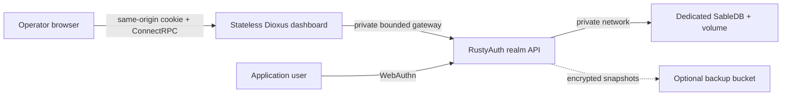
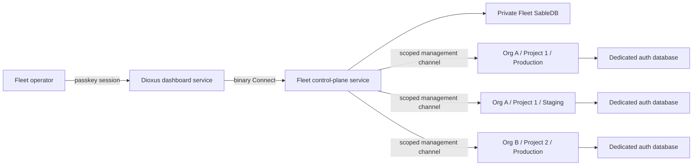

# RustyAuth fleet control-plane direction

**Status:** Accepted architecture; implementation in progress

**Date:** 8 August 2026

**Current priority:** Deliver the unified Dioxus dashboard and the first fully wired Fleet control-plane slice

**Current decision:**
[Unified Dioxus dashboard and multi-protocol Fleet control plane](decisions/0003-unified-dioxus-fleet-control-plane.md)

This document is the delivery architecture for managing many isolated RustyAuth deployments from one
dashboard. The first live web slice is implemented, but Fleet remains pre-release until the production and
security gates in this document pass. Existing data-plane releases still support one configured tenant and one
organization per instance.

## Executive decision

RustyAuth should offer two compatible product modes:

1. **Standalone:** a stateless Dioxus dashboard, one RustyAuth realm backend and its private identity
   database.
2. **Fleet-managed:** one central dashboard and control-plane API managing many independently deployed
   RustyAuth data planes across projects, environments, regions and cloud providers.

Fleet management must not turn the central dashboard into a shared authentication runtime or a shared identity
database. Each connected environment remains an isolated auth realm with its own users, passkeys, sessions,
signing keys, service credentials, events, backups and recovery boundary.

The future product direction is therefore:

> Centrally managed, locally isolated.

## Current boundary

Version `0.1.0` has one `Store`, one WebAuthn relying-party configuration, one issuer, one audience, one JWT
keyset, one exact browser origin and one SableDB `auth:*` namespace per process. The configured
`AUTH_TENANT_ID` tags tokens, events and backups; it does not partition user, session or index keys.

The current rules remain:

- deploy one RustyAuth instance for one independently trusted application environment;
- give it a private SableDB namespace and independent persistent volume;
- never point separate tenants at the same current SableDB namespace;
- do not share master, signing, bootstrap, RPC or backup keys across environments; and
- keep the browser same-origin with the RustyAuth API through the bounded dashboard gateway.

Fleet work must preserve those properties rather than weakening them for operational convenience.

## Terminology and resource hierarchy

Control-plane resources use explicit names instead of overloading `tenant`:

```text
Workspace
└── Organization
    └── Project
        └── Environment
            └── Auth realm / deployment
```

| Resource     | Meaning                                                                                                   |
| ------------ | --------------------------------------------------------------------------------------------------------- |
| Workspace    | Optional billing and top-level ownership boundary for one or more organizations                           |
| Organization | Administrative tenant, usually a company or brand, with members and role bindings                         |
| Project      | An application, product or independently managed service estate                                           |
| Environment  | A lifecycle boundary such as development, staging or production                                           |
| Auth realm   | The isolated identity, WebAuthn, issuer, signing and recovery boundary served by one RustyAuth deployment |
| Connection   | The authenticated management relationship between the fleet control plane and one auth realm              |

An environment normally has one auth realm. The separate term remains useful because a future project may
deliberately bind several clients to one centralized login realm, while another project keeps a realm per
client. That sharing requires an explicit identity and WebAuthn design; it must not emerge accidentally from a
shared database.

The current `AUTH_TENANT_ID` is an instance tag, not a future organization identifier. A future protocol
should carry stable `organization_id`, `project_id`, `environment_id` and `realm_id` values where each is
semantically required.

## Product mode 1: standalone

The existing template remains the simplest supported deployment:



Standalone mode is appropriate for one application, small estates, air-gapped installations,
customer-controlled deployments and environments that must not depend on a central management service.

The standalone dashboard talks only to its local RustyAuth API. Rust remains responsible for every
authorization decision and database mutation.

## Product mode 2: fleet-managed

Fleet mode adds a separate central management plane while retaining isolated data planes:



The data planes may run in different Railway projects, regions, cloud providers, private networks or customer
accounts. They share a versioned management protocol, not a database.

## Client-surface strategy

RustyAuth ships one Dioxus dashboard implementation with different deployment roles:

| Surface               | Location                                                                 | Purpose                                                         | Current state                                                           |
| --------------------- | ------------------------------------------------------------------------ | --------------------------------------------------------------- | ----------------------------------------------------------------------- |
| Standalone Dioxus web | Separate `rustyauth-dashboard` service targeting one realm backend       | Local administration and break-glass access for one realm       | Service split implemented; live local RPC parity pending                |
| Fleet Dioxus web      | Separate `rustyauth-dashboard` service targeting the Fleet control plane | Central organization, project, environment and realm management | Live passkeys, hierarchy, audit and public-endpoint pairing implemented |
| Dioxus desktop        | Signed package from `console/`                                           | Native Fleet operations with OS-protected device credentials    | Feature build implemented; live device flow pending                     |
| Dioxus mobile         | Package from `console/`                                                  | Approvals, health and constrained administration                | Shared feature build implemented; platform qualification pending        |

The Dioxus console is one Rust UI codebase with platform feature boundaries for web, desktop and mobile. The
initial clone deliberately consumes the existing design stylesheet and real brand assets so the surfaces have
the same typography, spacing, color, motion, charts and responsive behavior while the fleet information
architecture is introduced. Platform-specific capabilities such as secure credential storage, deep links,
notifications and window management belong behind adapters rather than inside shared screens.

The surfaces share screens and protocol types, but they do not share authority:

- the standalone web mode authenticates to its configured realm API origin;
- the fleet console authenticates to a separate control-plane API;
- neither browser nor native client connects directly to a realm database;
- the control plane resolves and authorizes the selected realm server-side; and
- a native package does not make remote management credentials safe to distribute to a client.

Accessible behavior primitives may come from the first-party Dioxus components project. Components from the
Rust/UI registry may be selectively vendored after accessibility, platform and dependency review. The console
must not couple its core navigation or charts to browser-only script injection when an equivalent native
Dioxus implementation is practical.

### Central control-plane responsibilities

The control plane owns:

- organizations, projects and environment inventory;
- fleet operator identities, memberships and role bindings;
- environment registration and connection lifecycle;
- encrypted references to environment-scoped management credentials;
- deployment version, capability and health inventory;
- bounded summary read models for fleet overviews;
- central operator audit records and request correlation; and
- orchestration of explicitly authorized management operations.

These records live in a dedicated Fleet datastore in the control plane's own environment or cloud. That store
also holds Fleet operator passkeys and sessions, device grants, idempotency records and central audit history.
It is backed up independently from every realm. The Dioxus dashboard owns no authoritative database and can be
replaced or scaled without a state migration.

### Data-plane responsibilities

Each RustyAuth deployment remains authoritative for:

- end-user accounts, identifiers and profiles;
- passkeys, ceremonies and sessions;
- the WebAuthn RP ID, allowed origin and presentation name;
- the issuer, audiences and JWT signing-key lifecycle;
- local operators and break-glass administration;
- environment service accounts and credentials;
- ordered identity events;
- identity verification state;
- backups, restore validation and recovery drills; and
- all mutations to its private identity database.

The control plane may cache bounded projections. It must not silently become the authoritative store for these
records.

## The connection is to RustyAuth, not its database

The fleet dashboard must connect to the management surface of each RustyAuth deployment. It must not connect
directly to SableDB, Redis, Valkey, Postgres or another data-plane database.

```text
Operator browser
    -> central dashboard and control API
    -> authenticated RustyAuth management API or outbound connector
    -> private environment database
```

Direct database connections are rejected because they would:

- require cross-cloud database exposure or broad network peering;
- bypass Rust authorization, validation, redaction and audit policy;
- couple the dashboard to private key layouts and stored-record versions;
- make rolling upgrades and capability negotiation unsafe;
- give one control-plane compromise unrestricted database access to every realm; and
- contradict the existing rule that SableDB is a persistence engine, not an authorization boundary.

The browser never receives environment management credentials. It authenticates only to the central
control-plane API, which resolves the selected realm, verifies the operator's authorization and performs the
remote request server-side.

## Fleet onboarding wizard

The dashboard should make fleet composition an ordinary resource workflow:

1. Create or select an organization.
2. Create or select a project.
3. Add an environment such as development, staging or production.
4. Choose **Deploy new RustyAuth** or **Connect existing RustyAuth**.
5. Provide a management endpoint and a short-lived, single-use pairing token, or select an outbound connector
   flow for a private deployment.
6. Verify endpoint ownership, TLS, version, capabilities, issuer, realm identity and health.
7. Exchange the pairing token for a revocable environment-scoped credential.
8. Delete or invalidate the pairing token and record the connection audit event.

The wizard may collect optional provider, account, project, region and display metadata. It must never request
or retain:

- `SABLEDB_URL` or another database connection string;
- JWT private or master keys;
- backup encryption keys;
- raw session records;
- a cloud account's unrestricted root credential; or
- a reusable bootstrap token intended for another purpose.

### Pairing an existing deployment

An existing deployment should produce a pairing token from a local trust boundary, for example:

```text
rustyauth fleet pair
```

or:

```text
Embedded dashboard -> Settings -> Fleet management -> Generate pairing code
```

The pairing token should be:

- high entropy;
- single use;
- short lived;
- bound to the target realm and intended control-plane origin;
- excluded from logs, URLs and browser persistence; and
- invalidated whether the exchange succeeds or reaches a terminal failure.

The exchange should create a first-class connection record on both sides. Either side can revoke the
connection without changing end-user identity state.

### Connection registry

A future control-plane connection record should include at least:

```text
id
organization_id
project_id
environment_id
realm_id
display_name
management_endpoint or connector_id
credential_reference
deployment_version
capabilities
issuer
rp_id
provider and region metadata
connection_status
last_seen_at
created_at
revoked_at
```

Credential material belongs in an approved encrypted secret boundary. The ordinary control-plane database
should store a reference and safe display metadata, not a plaintext reusable secret.

## Cross-cloud management channels

Fleet mode must support two connection styles.

### Public management endpoint

The control plane calls a versioned RustyAuth management API over public HTTPS. The endpoint uses a
realm-specific credential, strict TLS validation, request bounds and method-level scopes.

This is operationally simple, but the management API becomes an internet-facing security boundary. Discovery
and pairing must defend against server-side request forgery, DNS rebinding, unexpected redirects, invalid
certificates and endpoints that do not prove possession of the pairing token.

### Outbound connector

A private RustyAuth deployment establishes an authenticated outbound connection to the control plane. Commands
and responses travel over that connection, so the customer does not expose an inbound management endpoint or
database port.

The connector must verify signed, scoped, expiring commands; bind every command to one realm; enforce
idempotency; and produce local and central audit records. Losing the connection makes fleet views stale but
must not interrupt authentication.

## Management protocol

RustyAuth uses one versioned Protobuf service contract through three compatible transports. The pinned
`connectrpc` server accepts binary Connect, native gRPC and gRPC-Web, so every protocol reaches the same
limits, interceptors, authorization checks and audit policy.

| Channel                                   | Wire protocol                                                      | Credential                                             |
| ----------------------------------------- | ------------------------------------------------------------------ | ------------------------------------------------------ |
| Browser dashboard to control plane        | Same-origin binary Connect through the stateless dashboard gateway | Passkey-backed HttpOnly session cookie                 |
| Desktop/mobile dashboard to control plane | Binary Connect or native gRPC                                      | Short-lived device token                               |
| Control plane to public realm endpoint    | Native gRPC or binary Connect                                      | Revocable environment credential; mTLS where supported |
| Private realm to connector gateway        | Bidirectional native gRPC                                          | mTLS workload identity and signed commands             |

Binary encoding improves message size, parsing and contract safety. It does not replace TLS, authentication,
authorization, replay protection, request limits or audit.

The management protocol should be versioned independently from private storage. Its discovery document should
expose only safe metadata such as:

- deployment and protocol version;
- stable realm ID;
- issuer and RP ID;
- supported RPC protocols;
- capability names and versions;
- health and readiness support; and
- pairing or connector support.

Capabilities should be explicit rather than inferred from a version string. A newer dashboard must hide or
disable an operation when the selected deployment does not advertise the required capability.

Initial fleet credentials should be read-only and narrowly scoped, for example:

```text
environment.health.read
identity.read
events.read
metrics.read
backup.status.read
```

Mutation scopes should be separate and granted deliberately:

```text
identity.write
organization.write
service_accounts.write
connections.rotate
```

Every remote mutation needs a stable request ID, idempotency behavior, actor and target realm, authorization
result, reason, timestamp and redacted outcome in both audit boundaries.

## Unified read model

The fleet overview should remain useful without centralizing complete identity databases.

The control plane may retain bounded summaries such as:

- deployment health, readiness, version and last-seen time;
- account, passkey and active-session counts;
- recent authentication outcome aggregates;
- event cursors and redacted event summaries;
- backup recency and verification status; and
- signing-key lifecycle health without private material.

Detailed identity data should be fetched from the selected realm on demand. The initial fleet product should
not provide an unrestricted cross-organization user search. Any later federated search must be explicit,
permission checked, bounded, audited, tagged with its source realm and designed around data-residency
requirements.

Partial fleet failure must be visible. If three of five realms answer, the dashboard must present a partial
result with the two unavailable realms identified rather than treating their missing data as zero or empty.

## Operator identity and authorization

Fleet operator identity is a control-plane concern and must be separated from customer end-user identity
stored in any managed realm.

Role bindings should be scoped at organization, project or environment level. A higher-level role may flow
downward only through an explicit policy. Access to staging must not silently grant access to production, and
read permission must not imply mutation permission.

The first release should be read-only. Later administrative actions should require:

- a separately granted mutation scope;
- recent passkey authentication or explicit step-up;
- target-environment authorization;
- a human-readable reason for sensitive actions;
- complete audit records; and
- optional approval or break-glass policy for production.

The standalone Dioxus dashboard remains the local break-glass surface. Fleet registration must not remove a
customer's ability to administer or disconnect its own deployment.

## Availability and failure isolation

The data plane must never depend on the fleet control plane for an ordinary registration, authentication,
session validation, token issuance, JWKS response or backup operation.

If the control plane or connector is unavailable:

- end-user authentication continues;
- existing sessions continue under local policy;
- JWT issuance and verification continue;
- local events and backups continue;
- the standalone dashboard remains available where enabled; and
- central views clearly become stale or unavailable.

A failure or compromise in one managed realm must not grant access to any other realm. Credentials, request
routing, caches, event cursors, audit records and rate limits must all be keyed by the stable realm identity.

The central control plane has an inherently broad blast radius. It therefore requires stronger hardening than
an ordinary dashboard: isolated credential custody, least-privilege connections, step-up for mutations,
security monitoring, recovery drills and an independent threat review before production fleet writes are
enabled.

## Deployment topology

The architecture is cloud neutral. A representative Railway layout is:

```text
Fleet management Railway project
├── rustyauth-dashboard       public stateless Dioxus web + bounded Connect gateway
├── rustyauth-control-plane   private Rust Fleet API and orchestration service
├── fleet-sabledb             private stateful service + persistent volume
└── fleet-backups             encrypted object-storage resource

Application project A / production environment
├── rustyauth-backend         isolated realm API
└── realm-sabledb             private stateful service + persistent volume

Application project A / staging environment
├── rustyauth-backend         isolated realm API
└── realm-sabledb             private stateful service + persistent volume
```

A standalone template adds a Dioxus dashboard to one realm pair, producing three services. A Fleet project
also has three core services. A combined evaluation template containing Fleet and one local realm has five.
The optional connector gateway becomes a separate service only when long-lived connector volume needs an
independent scaling and deployment boundary.

The dashboard may scale horizontally because it is stateless. SableDB is independently sized, upgraded and
persisted but is not replica-scaled like a web service. The current control-plane and realm writer topologies
remain one replica until distributed locking, idempotency and event ordering are qualified.

For browser traffic, the dashboard forwards only named auth and RPC paths to the configured Railway private
service. That keeps the browser same-origin without making the dashboard process an authorization boundary.
The control plane and realm backend independently validate the session, origin, method policy and resource
scope. Native clients use a separately exposed API domain and short-lived device credentials.

### Fleet state and backup boundary

`fleet-sabledb` is authoritative only for Fleet concerns:

- Fleet operator accounts, passkeys, sessions and device grants;
- organizations, projects, environments, memberships and scoped role bindings;
- connection registry, encrypted credential references and pairing/idempotency state;
- central audit events; and
- bounded, source-tagged health and operational projections.

It does not store a second copy of complete realm identity databases. Each realm remains responsible for its
own encrypted backups. Fleet produces separate encrypted logical snapshots to `fleet-backups`, with encryption
keys held outside both the database volume and object-storage account. Backup qualification requires
retention, read-after-write verification and a clean-room restore that rebuilds the control plane without
contacting realm databases for authority.

Browser local storage and desktop/mobile caches are disposable. They are not backup sources and must not hold
realm credentials, database URLs or Fleet master material.

Private networking remains local to each application environment. Cross-project or cross-cloud management uses
authenticated HTTPS or the outbound connector; it never relies on direct access to the environment database.

## Migration and compatibility

Standalone and fleet-managed modes should use the same data-plane binary and public authentication contract.
Connecting a deployment to a fleet must not migrate its identities, replace its issuer, change its RP ID,
rotate its signing keys or interrupt its sessions.

A deployment should be able to move through this lifecycle:

```text
standalone -> paired -> fleet-managed -> disconnected -> standalone
```

Disconnecting removes the management relationship and central cached projections according to retention
policy. It does not delete the remote realm or its identity data.

Version skew is expected. The control plane must use capability discovery and additive protocol evolution
rather than assuming every deployment upgrades simultaneously.

## Security invariants

Fleet implementation must preserve these invariants:

1. A browser never receives a remote realm's management credential.
2. The control plane never needs a remote database connection string.
3. One realm's credential cannot name, query or mutate another realm.
4. Realm context comes from the authenticated connection and registry, not an untrusted request header alone.
5. No signing, master, backup or session secret crosses the management API.
6. All remote mutations are authorized and audited locally and centrally.
7. Authentication remains available when fleet management is unavailable.
8. Cached fleet data is bounded, source-tagged, retention-controlled and visibly stale when its source cannot
   be reached.
9. Pairing proves control of both the fleet organization and the target RustyAuth deployment.
10. A connected deployment can revoke the control plane without central cooperation.

## Roadmap sequence

Fleet management is now an active delivery program that preserves the single-tenant data-plane boundary.

### Phase 0: single-tenant foundation

- Complete account recovery and abuse controls.
- Complete event retention and delivery policy.
- Qualify concurrency and the supported writer topology.
- Expand authenticator and protocol-negative coverage.
- Complete an independent security assessment.
- Keep one organization and one tenant per instance.

### Phase 1: management contract foundations

- Maintain the Dioxus console's visual and interaction parity with the embedded local dashboard.
- Define the shared client protocol/model boundary and platform adapter interfaces.
- Give every deployment a durable, stable realm identity.
- Define versioned discovery and capability metadata.
- Separate local operator identity from future fleet operator identity.
- Define environment-scoped read-only service capabilities.
- Threat-model pairing, SSRF, credential custody and cross-realm routing.

### Phase 2: pairing and inventory

- Add one-time pairing from the realm CLI and standalone dashboard.
- Add the organization, project, environment and connection registry.
- Add connection health, version and capability views.
- Support clean disconnection and credential rotation.

### Phase 3: read-only fleet

- Add central deployment, backup and signing-health summaries.
- Add bounded event and metric read models.
- Add on-demand, selected-realm identity reads.
- Support public HTTPS and outbound connector deployments.
- Prove cross-organization negative authorization tests.

### Phase 4: controlled fleet administration

- Add environment-scoped mutation grants.
- Add passkey step-up, reasons, idempotency and dual audit records.
- Add production approval and break-glass policy.
- Add automated connection rotation and revocation drills.

### Phase 5: hosted and enterprise operation

- Qualify multi-region control-plane availability.
- Add data-residency, retention and export controls.
- Add enterprise federation and lifecycle integrations when evidence demands them.
- Complete an independent fleet threat assessment and recovery exercises.

## Post-Fleet program: Federated Fleet Analytics

Fleet Analytics begins only after the production Fleet program above is fully delivered and the main roadmap's
M8 exit gate passes. It is not an excuse to expand the Phase 3 bounded read model into a shared raw event lake
before the Fleet trust, recovery and residency boundaries are qualified.

The planned feature projects bounded metric buckets inside each realm, carries complete idempotent snapshots
over the authenticated outbound management boundary, stamps hierarchy in the trusted Fleet gateway and serves
realm, environment, project, organization and authorized fleet aggregates from a private central analytical
store. Versioned Parquet provides optional customer-owned recovery and backfill; routine dashboard requests do
not scan every foreign bucket.

The controlling documents are:

- [ADR 0004: Federated Fleet Analytics with trusted rollup ingestion](decisions/0004-federated-fleet-analytics.md)
- [Federated Fleet Analytics delivery program](FLEET_ANALYTICS.md)

The analytics program preserves every invariant in this document: realms remain authoritative, missing data is
visibly partial, remote deployments never connect to central databases directly and analytics failure never
interrupts authentication.

This sequence does not include shared-database multi-tenancy. Consolidating multiple auth realms into one
runtime or datastore would be a separate architecture decision with its own storage isolation, WebAuthn,
issuer, key-custody, backup, noisy-neighbor and cross-tenant testing requirements.

## Non-goals

This direction does not propose that RustyAuth:

- merges customer identity databases to make the dashboard easier to build;
- exposes databases to the central dashboard;
- makes end-user authentication depend on the hosted control plane;
- treats a user-supplied organization or realm header as authoritative;
- reuses a single credential across managed environments;
- silently enables fleet writes when only read access was paired;
- claims that central organization metadata is an application authorization engine; or
- promises shared-login SSO across different WebAuthn RP IDs without a separate protocol design.

## Open decisions

Before Phase 1 implementation, write architecture decisions for:

1. the durable realm ID and its relationship to issuer, RP ID and `AUTH_TENANT_ID`;
2. the pairing protocol and proof of endpoint ownership;
3. central credential custody and rotation;
4. public management endpoints versus outbound connectors;
5. the fleet operator identity and role-binding model;
6. read-model contents, retention and data-residency policy;
7. version and capability negotiation;
8. remote mutation idempotency and dual audit semantics; and
9. central control-plane compromise and recovery behavior.

Until those decisions and their rejection-path tests exist, the embedded single-instance dashboard and
one-tenant-per-instance topology remain the supported product.
