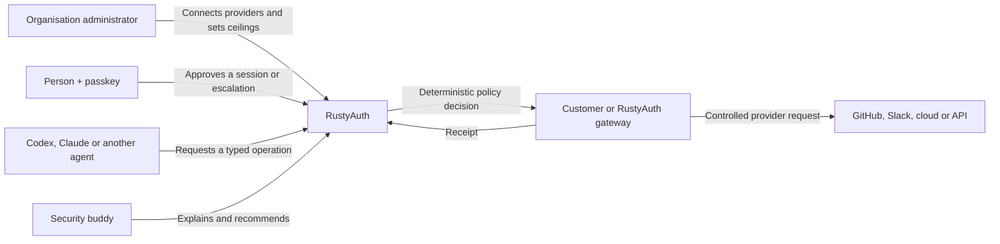

# RustyAuth future product strategy: agent authority

**Status:** Exploratory future feature and business strategy; not an implemented or committed roadmap

**Date:** 7 August 2026

**Related direction:** [RustyAuth authorization-platform direction](AUTHORIZATION_PLATFORM_DIRECTION.md)

This document records a possible future expansion of RustyAuth from a small passkey-first
authentication service into an open authority layer for people, applications and AI agents. It is
business and product exploration, deliberately separated from current architecture, API and roadmap
documentation. Nothing described here should be presented as planned or shipped until it has user
evidence, an explicit roadmap decision, an architecture decision record, a threat model,
implementation, tests and release documentation.

## Executive thesis

RustyAuth should not try to become a smaller Keycloak or another general-purpose identity suite. A
more differentiated opportunity is to answer a problem that conventional identity providers and
agent runtimes do not solve consistently:

> Which person authorised which agent to perform which exact action, on which resource, under which
> limits, and what proves the result?

The proposed positioning is:

> **Passkeys for people. Purpose-bound authority for agents.**

In this model, a person's passkey establishes the human root of approval. Every agent has its own
identity. RustyAuth converts a human-approved intent into a constrained, short-lived capability and
enforces that capability at a gateway in front of GitHub, Slack, cloud platforms, databases and
internal APIs.

The commercial product would let an organisation connect a provider once and safely delegate
selected operations to many employees and their agents without distributing the underlying
provider credentials.

## The problem

### The SSO tax is only part of the problem

Self-hosted identity providers exist, but applications frequently charge separately for OIDC,
SAML, SCIM or multi-provider federation. Even where SSO is available, it generally establishes only
who the person is. It does not express the task-specific authority needed by an autonomous agent.

Conventional OAuth grants are commonly too broad for agentic work. A token that permits repository
write access may cover creating a branch, modifying a workflow, merging a pull request and changing
other state. An agent usually needs only one of those actions for one task and a short period.

### Agents create a different authorization problem

An agent is neither simply the user nor a conventional service account. It is a software workload
that may plan dynamically, call tools, delegate to sub-agents and act on untrusted content. Prompt
injection, confused-deputy behaviour, token leakage and accidental scope expansion make long-lived
bearer credentials particularly dangerous.

Agent authority therefore needs five separate facts:

1. **Human identity:** who owns or approved the authority?
2. **Agent identity:** which workload is acting?
3. **Delegation:** what task and limits were approved?
4. **Enforcement:** is this exact operation allowed now?
5. **Receipt:** what happened and through which delegation chain?

## Product definition

RustyAuth would become an **agent access broker** with four cooperating surfaces:

1. A passkey-first identity and approval service.
2. An agent identity registry and delegation service.
3. A deterministic policy decision and capability-issuance service.
4. Provider gateways that retain provider credentials and enforce approved operations.



The core promise is:

> Connect a provider once. Delegate access safely many times.

## Design principles

### Authority comes from a grant, not from a passkey

An agent does not inherit cryptographic material or implicit power from a person's passkey. The
passkey proves that the person approved a stored grant. The passkey private key never leaves the
authenticator and is never copied to an agent.

Each agent generates or is assigned its own workload key. A RustyAuth capability binds the human
subject, agent actor, target resource, allowed operation, constraints, expiry and proof-of-possession
key.

```text
Person's passkey
    proves approval of
Development session or task grant
    which authorises
Separately identified agent
    to request
Constrained operations at a gateway
```

### Scope authority, not raw keys

Provider credentials remain with the provider gateway or an approved secret store. Agents receive
short-lived capabilities or local handles, not reusable GitHub, Slack, cloud or database secrets.

Where a provider can mint suitably narrow temporary credentials, RustyAuth should use them. Where
the provider's scopes are too broad, the gateway should retain the provider token and expose a
narrow typed operation.

### Every delegation narrows authority

Delegation must satisfy this invariant:

```text
child authority ⊆ parent authority ⊆ human-approved grant ⊆ organisation ceiling
```

A child agent can receive less authority or a shorter lifetime. It cannot widen the resource set,
add actions, extend expiry or increase its delegation depth. Revoking a parent grant revokes all of
its descendants.

### Models recommend; deterministic systems decide

An AI security buddy may translate a request, propose a narrower permission, explain a denial,
assess risk and route approval. It must not be the final policy decision point and must not mint
authority on its own.

The enforceable sequence is:

```text
Model recommendation
    -> typed and validated request
    -> deterministic policy evaluation
    -> human approval when required
    -> capability issuance
    -> gateway enforcement
```

### Native provider policy remains authoritative

RustyAuth adds a boundary; it does not bypass GitHub branch protection, cloud IAM, Slack app scopes,
database roles or other native controls. Effective authority is always the intersection of all
applicable ceilings.

## Authority profiles

An **authority profile** is a reusable policy template. It is not a credential and does not by
itself grant access. Profiles may be assigned to people, organisational groups, agent teams,
individual agent roles and development or operational sessions.

Example profiles include:

- repository maintainer;
- coding agent;
- pull-request reviewer;
- test runner;
- support responder;
- data analyst;
- staging deployer; and
- production operator.

Effective authority is calculated as:

```text
organisation policy
∩ person's delegable rights
∩ provider connection rights
∩ agent-team profile
∩ individual-agent profile
∩ current session or task grant
∩ provider-native policy
```

Each layer may narrow the result. No layer may expand a higher ceiling.

Profiles classify operations into three broad outcomes:

```yaml
automatic:
  - repository.read
  - test.execute
  - branch.push:
      pattern: "agent/*"

approval_required:
  - pull_request.mark_ready
  - workflow.modify
  - staging.deploy

prohibited:
  - repository.delete
  - branch_protection.disable
  - secrets.export
```

Operations within the profile proceed automatically. A potentially delegable expansion requests
approval. An operation above the user or organisation ceiling fails. High-risk operations may
require a fresh passkey assertion or multiple approvers.

## Rapid development and agent teams

Developers cannot predict and manually approve every command required during an exploratory coding
session. RustyAuth should therefore scope rapid development by environment and session rather than
attempting to pre-authorise every implementation step.

An owner could approve an eight-hour development envelope:

```yaml
owner: user:sean-knowles
resource: github:rusty-auth/rustyauth
expires_in: 8h

allow:
  - workspace.read
  - workspace.write
  - test.execute
  - branch.push:
      pattern: "agent/*"
  - pull_request.open_draft

approval_required:
  - workflow.modify
  - staging.deploy

deny:
  - pull_request.merge
  - secrets.export
  - production.deploy

delegation:
  local_child_agents: true
  maximum_depth: 2
```

The primary agent and its local sub-agents can work freely inside the development sandbox and the
approved external-operation envelope. A test agent may receive only repository read and test
execution. A review agent may receive repository read and pull-request comment permissions. The
owner is interrupted only when requested authority crosses an explicit boundary.

This is comparable to `sudo` for an agent session: approve a bounded working envelope once,
attenuate automatically within it, and require explicit approval when authority expands.

## Provider connections and exact operations

An organisation connects its GitHub organisation, Slack workspace, cloud accounts or internal APIs
to a RustyAuth workspace. Organisation administrators choose which underlying resources RustyAuth
may access and establish company-wide ceilings.

For example, an agent may request:

```text
Agent: security-reviewer-7
Repository: rusty-auth/rustyauth
Operation: create pull request
Source: agent/security-fix
Target: main
Maximum uses: 1
Expiry: 5 minutes
```

After policy evaluation and any required passkey approval, the agent receives a capability bound to
its own public key. The agent presents that capability to the GitHub gateway. The gateway uses its
GitHub App credential to perform the exact permitted operation, records a receipt and consumes the
one-use capability.

For a provider whose native token cannot express an exact operation, the gateway is the
fine-grained enforcement point. A Slack capability could permit posting one specified message to one
channel for five minutes without exposing the Slack token to the model or agent runtime.

## Enforcement boundary for Codex, Claude and other agents

RustyAuth cannot enforce policy merely because an agent client is running. Consumer model plans
authenticate a user to the model provider; they do not place RustyAuth in control of the local
process.

RustyAuth can enforce only the paths it controls:

| Action path | Enforcement |
| --- | --- |
| Agent uses a RustyAuth MCP tool | Enforceable |
| Agent uses a provider through a RustyAuth gateway | Enforceable |
| Agent presents a RustyAuth proof-bound capability | Enforceable |
| Agent runs `git push` with the person's existing SSH key | Not enforceable by RustyAuth |
| Agent uses a locally stored provider token | Not enforceable by RustyAuth |
| Agent controls an already authenticated browser | Not enforceable by RustyAuth |
| Agent modifies local files | Requires the agent client's sandbox or an outer sandbox |
| Agent sends data to its model provider | Requires model-provider and workspace data controls |

Codex and Claude can both consume MCP tools, which provides a vendor-neutral integration path.
Client-provided approvals, hooks and sandboxing can improve the user experience, but voluntary local
configuration is not a company-grade enforcement boundary. An agent that can access another token,
SSH agent, browser session or unrestricted network path can bypass the gateway.

Strong enforcement therefore requires the following conditions:

1. Provider credentials are absent from the agent environment.
2. Network and local credential access are restricted.
3. Provider-native organisation policy prevents or limits alternative credentials.
4. The RustyAuth gateway is the approved path for agent operations.

The defensible product claim is not that RustyAuth controls everything an arbitrary agent can do.
It is:

> RustyAuth controls what agents can do through an organisation's connected systems without giving
> those agents the underlying credentials.

## Product modes

### Bring Your Own Agent

Individuals and small teams connect Codex, Claude or another MCP client to RustyAuth Cloud or a
self-hosted RustyAuth instance. They receive passkey approvals, scoped provider operations, agent
profiles and audit receipts.

This mode strongly enforces operations routed through RustyAuth, but a user who retains alternative
provider credentials can deliberately bypass it. It is an adoption and developer-experience product,
not a tamper-proof organisational control.

### Managed Agent Access

Organisations combine RustyAuth with managed workstations, containers or remote development
environments. A possible launcher is:

```sh
rustyauth run codex
rustyauth run claude
```

The launcher would provide an isolated home directory, an approved workspace mount, no access to the
person's SSH agent or keychain, restricted network egress, an automatically configured RustyAuth MCP
connection and a short-lived agent-session identity.

In this mode, organisation policy, provider connections, runtime isolation and network controls make
the gateway an enforceable choke point.

### Hybrid enterprise deployment

Security-sensitive customers may not permit provider credentials or sensitive payloads to enter a
hosted control plane. A hybrid topology separates governance from execution:

```text
RustyAuth Cloud control plane
  - people and groups
  - agent registry
  - policies and profiles
  - approvals
  - audit metadata

Customer-hosted RustyAuth gateway
  - provider credentials
  - sensitive request payloads
  - provider calls
  - local enforcement
```

## Security buddy

The security buddy is an assistive interface over the deterministic authority system. It should:

- translate natural-language requests into typed permission requests;
- recommend the narrowest useful scope and lifetime;
- show permission changes as a clear diff;
- identify risky combinations and delegation paths;
- explain denials in plain language;
- route approvals to the correct resource owner;
- identify unused, dormant or excessive grants; and
- summarise receipts for incident response and audit.

It must not approve its own requests, change organisation ceilings, access provider credentials or
override a policy denial.

## Product surfaces

A coherent SaaS interface would contain:

- **People:** employees, groups, owners and company roles.
- **Agents:** registered agents, blueprints, owners, runtimes and lifecycle state.
- **Connections:** GitHub, Slack, cloud accounts, databases and internal APIs.
- **Profiles:** reusable human, team and agent authority templates.
- **Approvals:** queued requests, scope diffs and multi-party decisions.
- **Activity:** delegation chains, gateway actions, receipts and revocation.
- **Security buddy:** recommendations, explanations and investigations.

RustyAuth should federate with an organisation's existing Entra, Okta, Google or other identity
provider rather than attempting to replace its employee directory. Its differentiated responsibility
is agent authority.

## Initial product wedge

The first target customer should be a B2B SaaS company adding agents that act on customer data or
connected customer systems. These companies need to hold broad customer OAuth credentials, satisfy
enterprise security reviews and explain what their agents can do. A narrow authority gateway can
reduce that risk and shorten their implementation time.

The first compelling demonstration is:

> Allow this coding agent to create a branch, push commits and open one draft pull request in
> `rusty-auth/rustyauth` during the next fifteen minutes. It cannot merge, change repository settings
> or access another repository.

The demonstration should prove:

1. Passkey approval of a structured mandate.
2. A separately identified agent with an ephemeral key.
3. A proof-bound, short-lived and single-resource capability.
4. A GitHub gateway retaining the real provider credential.
5. Rejection of replay, widening and use by a different agent.
6. A human-readable receipt and immediate revocation.

## Open-source and commercial boundary

The product should avoid recreating the SSO tax. The governing principle is:

> Protocols and security controls remain open; customers pay for operation, governance and
> assurance.

The open RustyAuth core should contain the complete security foundation:

- passkeys and standards-compliant OIDC/OAuth support;
- agent identities and delegation grants;
- the mandate and capability model;
- an MCP/API gateway;
- proof-of-possession support;
- an interoperable policy decision API;
- local audit receipts and revocation; and
- generic connectors and SDKs.

Commercial offerings may include:

- managed databases, key custody, rotation and backups;
- high availability and regional deployment;
- managed upgrades and migrations;
- fleet administration across environments;
- hosted audit retention, alerts and incident response;
- managed and continuously tested provider connectors;
- private-cloud or customer-VPC deployment;
- HSM/KMS integration and data residency;
- SIEM and compliance evidence exports;
- service-level agreements and priority support; and
- embedded or OEM support.

Pricing should use predictable environment, protected-application and registered-agent scale bands.
RustyAuth should not charge per authorization decision because that discourages frequent policy
checks. Initial pricing hypotheses, subject to design-partner validation, are:

| Offering | Illustrative price | Intended customer |
| --- | ---: | --- |
| Developer | Free | Evaluation and small self-hosted projects |
| Team | GBP 99-249 per month | Startups with a small application estate |
| Scale | GBP 750-2,000 per month | Production B2B agent products |
| Enterprise | GBP 25,000-150,000+ per year | Large or regulated organisations |
| Embedded/OEM | Annual minimum | Platforms embedding the authority gateway |

Before the full platform exists, paid design partnerships can validate demand. A design partner
would fund one or two real provider integrations, passkey-approved delegation, gateway enforcement,
revocation and audit. The work should produce reusable product capabilities rather than bespoke
consulting branches.

## Route from the current product

The current RustyAuth implementation is a pre-release authentication service, not a general OpenID
Provider or authorization engine. The proposed strategy cannot safely skip its existing production
gates.

### Phase 0: complete the human trust foundation

Automatic signing-key rotation with retired-key overlap and scheduled, verified backups with
clean-room restore are now implemented foundation capabilities. The remaining gates are:

- Account recovery and abuse controls.
- Stable event delivery.
- Cross-instance concurrency and multi-writer design.
- Broader protocol-negative and authenticator coverage.
- Independent security assessment.

Agent-authority prototypes may proceed independently, but they must not be presented as production
capabilities while this foundation is incomplete.

### Phase 1: standards-compliant authorization server

- OAuth authorization code flow with PKCE.
- Client and redirect-URI registration.
- ID tokens and standards-compliant discovery.
- Resource indicators and audience restriction.
- Refresh-token rotation and revocation.
- Provider federation needed for company users.

### Phase 2: first-class agent identity

- Agent blueprints and runtime instances.
- Owners or organisational sponsors.
- Ephemeral proof-of-possession keys.
- Lifecycle state, expiry and emergency disablement.
- Separation of human subject, agent actor and authentication method.

The current development handoff represents an agent as a user session whose authentication method is
`agent`. That mechanism is useful only for local development and must not become the production
agent-identity model.

### Phase 3: mandates and delegation

- Typed resources, actions and argument constraints.
- Authority profiles and organisation ceilings.
- Parent-child attenuation and maximum delegation depth.
- One-use and time-bounded capabilities.
- Passkey step-up and multi-party approval.
- Cascading revocation and receipts.

### Phase 4: enforcement and integration

- MCP authorization server and tool gateway.
- GitHub App reference connector.
- Provider credential vault boundary.
- Interoperable policy decision API.
- TypeScript, Python, Rust and Go integration libraries.
- Local managed launcher or reference dev-container profile.

### Phase 5: commercial operations

- Hosted control plane.
- Customer-hosted gateways.
- Fleet management, alerting and audit retention.
- Certified connectors and enterprise support.
- Compliance and operational evidence.

SAML, SCIM and broad identity-suite compatibility may be added when demanded by integrations. They
are not the initial innovation wedge.

## Non-goals

This strategy does not propose that RustyAuth:

- controls arbitrary local agents that can access alternative credentials;
- replaces operating-system, container or endpoint security;
- replaces native provider authorization and branch protection;
- lets a model make the final decision about its own permissions;
- exposes provider secrets to an LLM context;
- invents new cryptography when established standards are suitable;
- becomes a full enterprise identity directory before validating agent authority; or
- claims that an agent identity alone makes nondeterministic behaviour safe.

## Standards direction

The implementation should prefer stable standards and isolate experimental adapters:

- OAuth 2.0 Token Exchange for actor and token exchange semantics;
- OAuth 2.0 Rich Authorization Requests for structured authorization details;
- OAuth DPoP for proof-of-possession token binding;
- OAuth Protected Resource Metadata and the MCP authorization profile;
- OpenID AuthZEN Authorization API for policy decision interoperability; and
- WebAuthn for human authentication and step-up approval.

IETF work on transaction tokens, agent context, actor chains and agent authorization remains in
draft form. RustyAuth should track it and maintain an internal canonical grant model rather than
making an unstable draft the durable storage contract.

References:

- [OAuth 2.0 Token Exchange, RFC 8693](https://www.rfc-editor.org/info/rfc8693/)
- [OAuth 2.0 Rich Authorization Requests, RFC 9396](https://www.rfc-editor.org/info/rfc9396/)
- [OAuth 2.0 Demonstrating Proof of Possession, RFC 9449](https://www.rfc-editor.org/info/rfc9449/)
- [OpenID Authorization API 1.0](https://openid.net/specs/authorization-api-1_0.html)
- [MCP authorization](https://modelcontextprotocol.io/specification/2025-11-25/basic/authorization)
- [IETF Transaction Tokens for Agents draft](https://datatracker.ietf.org/doc/html/draft-oauth-transaction-tokens-for-agents)
- [IETF AI Agent Authentication and Authorization draft](https://datatracker.ietf.org/doc/draft-klrc-aiagent-auth/)
- [Codex agent approvals and security](https://learn.chatgpt.com/docs/agent-approvals-security.md)
- [Codex MCP support](https://learn.chatgpt.com/docs/extend/mcp.md)
- [Claude Code CLI and permission surface](https://docs.anthropic.com/en/docs/claude-code/cli-usage)

## Validation questions

The next strategy work should answer these questions with potential customers and prototypes:

1. Will B2B agent companies route provider actions through an independent gateway?
2. Which first connector produces enough value to justify adopting the control plane?
3. What authority-profile vocabulary is understandable without security training?
4. Which operations can use provider-native temporary credentials and which require proxy
   enforcement?
5. How should an agent prove its workload identity across local, hosted and third-party runtimes?
6. What evidence do enterprise security reviewers require from an agent delegation receipt?
7. How much local bypass resistance do teams expect from a Bring Your Own Agent product?
8. Which deployment model will customers accept for provider credentials and sensitive payloads?
9. Can a paid design partner reach a useful production boundary before the broader identity suite is
   built?
10. Which agent-authentication drafts are converging sufficiently to inform the durable data model?

The strategy should advance only when these questions produce evidence, not solely because the
technical model is attractive.
